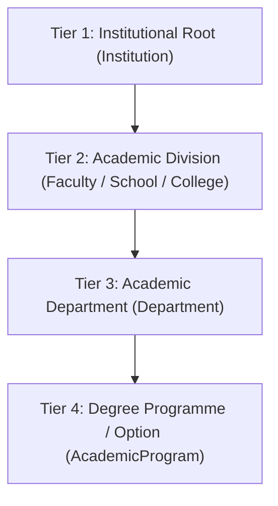

# Edusal Consult — Agent & Engineering Architecture Charter

> **STATUS**: MANDATORY CONSTITUTION  
> **APPLIES TO**: All AI Agents, Autonomous Subagents, and Human Developers working on the **Edusal** codebase.  
> **PRIMARY GOAL**: Prevent architectural degradation, enforce multi-tenant isolation, maintain the "Zero Unbacked Claims" data model, and preserve design excellence.

---

## 1. Executive Mission & System Philosophy

**Edusal Consult** is the Career Services and Employability Operating System engineered specifically for Nigerian tertiary institutions:
- **Universities** (Regulated by NUC)
- **Polytechnics & Monotechnics** (Regulated by NBTE)
- **Colleges of Education** (Regulated by NCCE)

### The Core Law: "Zero Unbacked Claims"
Every skill, outcome metric, student score, document answer, and placement recommendation must be backed by verifiable evidence:
1. **Never allow self-reported unverified resume bullet points** to calculate employability ratings.
2. **Every technical milestone must be signed off by a named evaluator** (Faculty Supervisor, HOD, Counsellor, or Industry Assessor).
3. **Every AI Assistant guidance response must cite exact page and section numbers** from grounded institutional documents in PostgreSQL `pgvector`.
4. **Zero cross-tenant leaks**: An institutional user logged into one institution must never see or query data belonging to another institution.

---

## 2. Infrastructure & Runtime Topology

| Service | Technology | Internal Port | Host Port | URL / Access |
| :--- | :--- | :--- | :--- | :--- |
| **Backend API** | Django 6.0 + DRF | `8000` | **`8001`** | `http://localhost:8001/api/` |
| **Frontend Web** | React 19 + TypeScript + Vite | `5173` | **`5173`** | `http://localhost:5173/` |
| **Database** | PostgreSQL 16 + `pgvector` v0.8.6 | `5432` | `5432` | `postgres:5432/edusal` |
| **Task Queue** | Celery + Redis | `6379` | `6379` | `redis:6379/0` |
| **Celery Monitor**| Flower | `5555` | `5555` | `http://localhost:5555/` |
| **Mail Server** | Mailpit (SMTP/Web) | `1025 / 8025` | `8025` | `http://localhost:8025/` |
| **API Docs** | drf-spectacular (OpenAPI 3.0) | — | **`8001`** | `http://localhost:8001/api/docs/` |

> [!IMPORTANT]
> **Host Port 8001**: Django is mapped to host port **`8001`** because port `8000` is reserved. Never change this without explicit user instruction.

---

## 3. Strict Design & UI Constitution

### Rule 1: Zero Emojis Anywhere
- **STRICTLY PROHIBITED**: Unicode emoji symbols (e.g., 🏛️, 🔒, ⏳, 📜, 🤝, 🇳🇬, 🎯, 🏢, etc.) must NEVER be placed in UI components, headings, buttons, pills, tables, or modals.
- **MANDATORY ALTERNATIVE**: Import clean, modern, open-source SVG icons from [`frontend/src/components/icons/index.tsx`](file:///home/cainoa/dev/projects/edusal/frontend/src/components/icons/index.tsx) (e.g. `<BuildingIcon />`, `<FolderTreeIcon />`, `<LockIcon />`, `<ShieldCheckIcon />`, `<UsersIcon />`, `<FileTextIcon />`, `<CheckCircleIcon />`, etc.).

### Rule 2: Opaque, High-Contrast Forms & Modals
- **NEVER use transparent backgrounds for modals or forms**: All modal wrappers (`.modal-content`, `.modal-container`, `.modal-form`) must have solid `#ffffff` background with explicit borders (`#cbd5e1`) and elevation shadows.
- **Form Labels**: Must always use bold, high-contrast dark text (`color: #0f172a !important; font-weight: 700;`).
- **Form Inputs, Selects & Textareas**: Must always have solid white background (`#ffffff`), visible borders (`1.5px solid #cbd5e1`), dark legible input text (`#0f172a`), and active focus rings (`#0284c7`).

### Rule 3: Single-Tenant Strict Isolation
- When logged into an institutional staff account (e.g., `csc@futminna.edu.ng` or `csc@gsu.edu.ng`), the UI must display a locked institutional badge (`.inst-locked-pill`) and **NEVER display a cross-institution switcher dropdown**.
- To view another institution, the user must explicitly **Sign Out** and authenticate with an account belonging to that institution.

---

## 4. 4-Tier Academic Hierarchy Standard

Every Nigerian tertiary institution is structured in a standardized 4-tier relational model:



### Regulatory Hierarchy Specifications:
1. **Universities (NUC)**:
   - *Tier 1*: University (e.g., *Federal University of Technology, Minna* or *Gombe State University*)
   - *Tier 2*: Faculty or School (`tier_two_term = 'FACULTY'` or `'SCHOOL'`, e.g., *School of ICT* or *Faculty of Science*)
   - *Tier 3*: Department (e.g., *Department of Computer Science*)
   - *Tier 4*: Programme / Degree Option (e.g., *B.Tech Computer Science*, *B.Sc. Software Engineering*)
2. **Polytechnics & Monotechnics (NBTE)**:
   - *Tier 1*: Polytechnic (e.g., *Yaba College of Technology*)
   - *Tier 2*: School (`tier_two_term = 'SCHOOL'`, e.g., *School of Technology*)
   - *Tier 3*: Department (e.g., *Department of Computer Technology*)
   - *Tier 4*: Programme Option (e.g., *National Diploma (ND) Computer Science*, *Higher National Diploma (HND) Software Track*)
3. **Colleges of Education (NCCE)**:
   - *Tier 1*: College of Education (e.g., *Federal College of Education, Zaria*)
   - *Tier 2*: School (`tier_two_term = 'SCHOOL'`, e.g., *School of Sciences*)
   - *Tier 3*: Department (e.g., *Department of Mathematics Education*)
   - *Tier 4*: Subject Combination (e.g., *NCE Mathematics / Computer Science Combination*)

---

## 5. Seeded Test Accounts & RBAC

All test accounts across seeded archetypes use the standard password: **`1234!@#$`**

| Email | Institution | Regulator | Archetype | Role | Assigned Profile |
| :--- | :--- | :--- | :--- | :--- | :--- |
| `csc@futminna.edu.ng` | FUTMinna | NUC | Federal Univ | `SUPERADMIN` | Prof. Mohammed Bashir *(Dean, SICT)* |
| `admin@futminna.edu.ng` | FUTMinna | NUC | Federal Univ | `DIRECTOR_CAREER_SERVICES` | ITCC & Career Services Directorate |
| `csc@gsu.edu.ng` | GSU | NUC | State Univ | `HOD` | Dr. Umar Faruk *(HOD, Computer Science)* |
| `admin@gsu.edu.ng` | GSU | NUC | State Univ | `SUPERADMIN` | Directorate of Academic Planning |
| `csc@yabatech.edu.ng` | YabaTech | NBTE | Polytechnic | `HOD` | Mrs. O. A. Adeleke *(HOD, Computer Tech)* |
| `admin@yabatech.edu.ng` | YabaTech | NBTE | Polytechnic | `SUPERADMIN` | Centre for Linkages & Career Services |
| `csc@fcezaria.edu.ng` | FCE Zaria | NCCE | College of Ed | `HOD` | Dr. Aisha Garba *(HOD, Math Education)* |
| `admin@fcezaria.edu.ng` | FCE Zaria | NCCE | College of Ed | `SUPERADMIN` | Provost Academic Planning Directorate |

---

## 6. Data Modeling & Database Conventions

### 1. Custom User Model
- Defined in [`backend/edusal/users/models.py`](file:///home/cainoa/dev/projects/edusal/backend/edusal/users/models.py).
- `USERNAME_FIELD = "email"` (There is **no** username field). All queries must filter by `email`.

### 2. UUID Primary Keys
- All core business models (`Institution`, `AcademicDivision`, `Department`, `AcademicProgram`, `InstitutionalDocument`, `InstitutionStaff`, `StudentProfile`, etc.) use `UUIDField(primary_key=True, default=uuid.uuid4, editable=False)`.

### 3. pgvector Grounding & Semantic Search
- Handbooks, curriculum documents, and SIWES policies are stored in `InstitutionalDocument`.
- Chunks are stored in `InstitutionalDocumentChunk` with `content_hash` and indexed using PostgreSQL `pgvector`.
- The citation search endpoint `POST /api/institutions/<id>/search-documents/` extracts page numbers, section references, and direct text excerpts to guarantee 0% hallucination.

---

## 7. Upcoming Roadmap Modules (Do Not Violate)

When building subsequent phases, adhere to these predefined architectural models:

### Phase 2: Student Workspace & Employability Score Engine
- **Models**: `StudentProfile` (matric_number, institution, department, program, entry_year, current_level, cgpa), `VocationalDiagnostic` (Holland RIASEC scores, Big Five calibration), `StudentMilestoneProgress` (milestone, status, score, artifact_url, signed_by, signed_at), `EmployabilityScore` (0–100 calculated score).
- **The 100-Point Employability Score Formula**:
  $$\text{Score} = \text{Diagnostic (20 pts)} + \text{Signed Milestones (45 pts)} + \text{Practical Artifact (20 pts)} + \text{Counsellor Endorsement (15 pts)}$$
- **Explainability**: Every score display must show the exact breakdown and never output an arbitrary number.

### Phase 3: Faculty Evaluator & Counsellor Desk
- **Models**: `CounsellorDeskCase`, `MilestoneEvaluationAudit`, `AIInterventionTicket` (`Ticket #CS-xxxx`), `OfficeHourAppointment`.
- **Caseload Queue**: Triage students flagged for SIWES deadline blockers or skill exceptions.

### Phase 4: Employer Placement & SIWES Portal
- **Models**: `EmployerProfile`, `PlacementVacancy` (stipend, location, housing, required_milestone_rubric), `PlacementApplication`, `SIWESAttestationContract`.
- **Pre-Filtering**: Employers search by verified milestone credentials, not unvalidated resume text.

---

## 8. Agent Engineering Rules & Verification Checklist

Before reporting any task complete, every agent MUST execute the following verification steps:

1. **Backend Integration Tests**:
   ```bash
   docker compose -f docker-compose.local.yml exec django pytest
   ```
   *Rule: All tests must pass with 0 errors.*

2. **Frontend Type Checking & Build**:
   ```bash
   cd frontend && npm run build
   ```
   *Rule: Must compile with 0 TypeScript and 0 bundler errors.*

3. **No Emojis Check**:
   *Rule: All UI icons must come from `src/components/icons/index.tsx`.*

4. **Git Sync**:
   *Rule: Clean working tree committed with Conventional Commits (`feat:`, `fix:`, `docs:`, `refactor:`) and pushed to `origin main`.*
