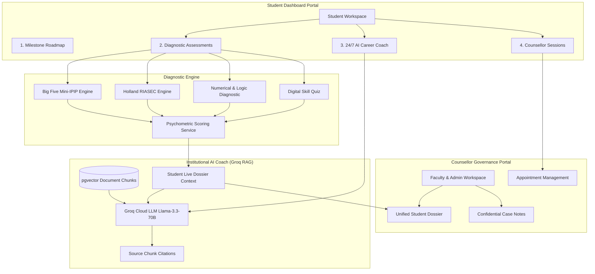
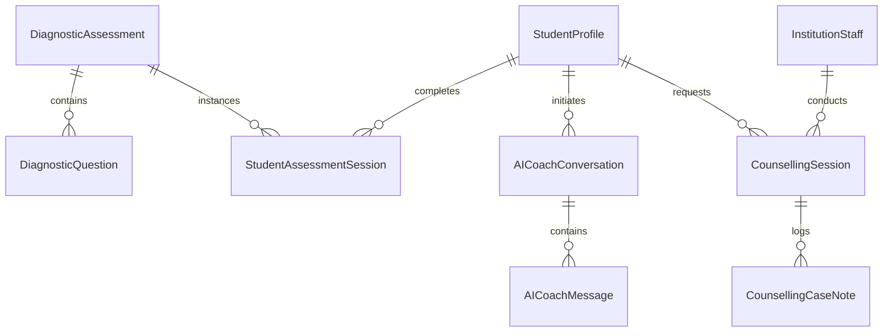

# Comprehensive Implementation Plan: Diagnostic Assessments, 24/7 AI Career Coaching & Seamless Counsellor Handoff

---

## 1. Executive Summary & Architectural Vision

This specification defines the architecture, database schema, mathematical scoring algorithms, RAG pipeline extensions, and frontend component ecosystem for three core pillars of the **EduSal Student Career Platform**:

1. **Psychometric & Diagnostic Assessments Engine**: Built-in, scientifically validated assessment tools:
   - **Big Five Personality Test** (Mini-IPIP $5$-Factor OCEAN model: Openness, Conscientiousness, Extraversion, Agreeableness, Emotional Stability).
   - **Holland RIASEC Interest Inventory** (Realistic, Investigative, Artistic, Social, Enterprising, Conventional) generating standard $3$-letter Holland vocational codes.
   - **Numerical & Logical Reasoning Diagnostic** (Timed diagnostic evaluating analytical deductions and quantitative problem solving).
   - **Digital & Technical Skill Diagnostic** (Domain-specific technical aptitude check aligned to degree programs).
   - **Pathway Alignment & Employability Integration**: Results feed directly into career pathway compatibility rankings and accredited employability profiles.

2. **24/7 AI Career Coaching & Support (Grounded Institutional RAG)**:
   - Conversational AI coach powered by Groq LLM (`llama-3.3-70b-versatile` / `llama-3.1-8b-instant`).
   - Contextually grounded via **PostgreSQL pgvector cosine semantic search** over institutional handbooks, SIWES calendars, course outlines, internship rubrics, and employer briefs.
   - Infused with the student's real-time identity: current level, enrolled career pathway, completed milestones, CGPA, and diagnostic assessment scores.
   - Provides verified answers on resume tailoring, cover letters, SIWES logistics (ITCC Form 08, stipend rules), and milestone preparation with source citations.

3. **Seamless Counsellor Handoff & Unified Student Dossier**:
   - Direct appointment booking and communication between students and their assigned departmental counsellors / HODs.
   - **Automated Counsellor Briefing Dossier**: When a counsellor engages with a student, the platform presents a unified brief containing psychometric traits, Holland code, milestone completion status, CGPA, and an AI-generated 3-bullet coaching summary.
   - Counsellors document private case notes, action plans, and milestone approvals directly linked to the student's unified record.

---

## 2. System Architecture Diagram



---

## 3. Data Models & Database Architecture (Django ORM)

All models reside in `backend/edusal/institutions/models.py` with multi-tenant isolation, UUID primary keys, and index optimizations.



### 3.1. Assessment Types & Models

```python
class AssessmentType(models.TextChoices):
    BIG_FIVE = "BIG_FIVE", "Big Five Personality Inventory (OCEAN)"
    HOLLAND_RIASEC = "HOLLAND_RIASEC", "Holland RIASEC Vocational Interests"
    NUMERICAL_REASONING = "NUMERICAL_REASONING", "Numerical & Logical Reasoning"
    DIGITAL_SKILLS = "DIGITAL_SKILLS", "Digital & Technical Skill Diagnostic"


class DiagnosticAssessment(models.Model):
    """Catalog of available diagnostic & psychometric tests."""
    id = models.UUIDField(primary_key=True, default=uuid.uuid4, editable=False)
    institution = models.ForeignKey(
        Institution, on_delete=models.CASCADE, null=True, blank=True,
        help_text="Null for national standard assessments; set for institution-customized tests."
    )
    assessment_type = models.CharField(max_length=40, choices=AssessmentType.choices)
    title = models.CharField(max_length=200)
    slug = models.SlugField(max_length=200, unique=True)
    description = models.TextField()
    instructions = models.TextField(blank=True, default="")
    estimated_minutes = models.PositiveIntegerField(default=10)
    total_questions = models.PositiveIntegerField(default=20)
    is_active = models.BooleanField(default=True)
    created_at = models.DateTimeField(auto_now_add=True)
    updated_at = models.DateTimeField(auto_now=True)


class DiagnosticQuestion(models.Model):
    """Individual item in a diagnostic assessment item bank."""
    id = models.UUIDField(primary_key=True, default=uuid.uuid4, editable=False)
    assessment = models.ForeignKey(DiagnosticAssessment, on_delete=models.CASCADE, related_name="questions")
    order_index = models.PositiveIntegerField(default=0)
    prompt = models.TextField(help_text="e.g. 'I am the life of the party' or math question prompt")
    dimension = models.CharField(
        max_length=50,
        help_text="Trait/Subscale code: e.g. 'OPENNESS', 'CONSCIENTIOUSNESS', 'REALISTIC', 'INVESTIGATIVE', 'LOGIC'"
    )
    is_reverse_scored = models.BooleanField(default=False, help_text="True if Likert scale must be inverted (6 - score)")
    question_type = models.CharField(
        max_length=30,
        choices=[("LIKERT_5", "5-Point Likert Scale (1-5)"), ("MULTIPLE_CHOICE", "Multiple Choice Single Answer")],
        default="LIKERT_5"
    )
    options = models.JSONField(
        default=list, blank=True,
        help_text="For multiple-choice questions: list of [{id: 'A', text: '...', is_correct: True, points: 10}]"
    )
    explanation = models.TextField(blank=True, default="")

    class Meta:
        ordering = ["assessment", "order_index"]


class StudentAssessmentSession(models.Model):
    """Recorded student assessment attempt with computed psychometric profile."""
    id = models.UUIDField(primary_key=True, default=uuid.uuid4, editable=False)
    student = models.ForeignKey(StudentProfile, on_delete=models.CASCADE, related_name="assessment_sessions")
    assessment = models.ForeignKey(DiagnosticAssessment, on_delete=models.CASCADE, related_name="sessions")
    status = models.CharField(
        max_length=30,
        choices=[("IN_PROGRESS", "In Progress"), ("COMPLETED", "Completed"), ("ABANDONED", "Abandoned")],
        default="IN_PROGRESS"
    )
    raw_responses = models.JSONField(default=dict, help_text="Dict of {question_id: selected_value}")
    dimension_scores = models.JSONField(
        default=dict,
        help_text="Dict of subscale scores: e.g. {'OPENNESS': 82, 'CONSCIENTIOUSNESS': 90, ...}"
    )
    summary_code = models.CharField(max_length=20, blank=True, default="", help_text="e.g. Holland Code 'IRC' or 'O82-C90'")
    percentile_rank = models.DecimalField(max_digits=5, decimal_places=2, null=True, blank=True)
    summary_report = models.TextField(blank=True, default="")
    career_recommendations = models.JSONField(default=list, blank=True)
    started_at = models.DateTimeField(auto_now_add=True)
    completed_at = models.DateTimeField(null=True, blank=True)

    class Meta:
        ordering = ["-completed_at", "-started_at"]
```

---

### 3.2. 24/7 AI Career Coach Models

```python
class AICoachConversation(models.Model):
    """Multi-turn conversation thread between student and 24/7 AI Coach."""
    id = models.UUIDField(primary_key=True, default=uuid.uuid4, editable=False)
    student = models.ForeignKey(StudentProfile, on_delete=models.CASCADE, related_name="ai_conversations")
    title = models.CharField(max_length=200, default="Career & SIWES Advisory Session")
    is_active = models.BooleanField(default=True)
    case_summary = models.TextField(blank=True, default="", help_text="AI-synthesized summary of student needs for counsellor handoff")
    created_at = models.DateTimeField(auto_now_add=True)
    updated_at = models.DateTimeField(auto_now=True)

    class Meta:
        ordering = ["-updated_at"]


class AICoachMessage(models.Model):
    """Individual message turn in an AI Coach conversation."""
    id = models.UUIDField(primary_key=True, default=uuid.uuid4, editable=False)
    conversation = models.ForeignKey(AICoachConversation, on_delete=models.CASCADE, related_name="messages")
    role = models.CharField(max_length=20, choices=[("user", "Student"), ("assistant", "AI Coach"), ("system", "System Grounding")])
    content = models.TextField()
    citations = models.JSONField(default=list, blank=True, help_text="List of grounded institutional document references")
    telemetry = models.JSONField(default=dict, blank=True, help_text="Latency, tokens, model name")
    created_at = models.DateTimeField(auto_now_add=True)

    class Meta:
        ordering = ["created_at"]
```

---

### 3.3. Counsellor Booking & Handoff Models

```python
class CounsellingTopic(models.TextChoices):
    PATHWAY_ALIGNMENT = "PATHWAY_ALIGNMENT", "Career Pathway & Milestone Planning"
    SIWES_CLEARANCE = "SIWES_CLEARANCE", "SIWES Placement, Logbook & Clearance"
    ASSESSMENT_DEBRIEF = "ASSESSMENT_DEBRIEF", "Psychometric & Skills Diagnostic Debrief"
    RESUME_CV_REVIEW = "RESUME_CV_REVIEW", "Resume, Portfolio & Cover Letter Review"
    EMPLOYER_PLACEMENT = "EMPLOYER_PLACEMENT", "Graduate Job Placement & Internship Advisory"
    ACADEMIC_STANDING = "ACADEMIC_STANDING", "Academic Standing & CGPA Improvement"


class CounsellingSessionStatus(models.TextChoices):
    REQUESTED = "REQUESTED", "Session Requested"
    CONFIRMED = "CONFIRMED", "Confirmed / Scheduled"
    COMPLETED = "COMPLETED", "Completed"
    RESCHEDULED = "RESCHEDULED", "Rescheduled"
    CANCELLED = "CANCELLED", "Cancelled"


class CounsellingSession(models.Model):
    """Scheduled 1-on-1 career counselling appointment."""
    id = models.UUIDField(primary_key=True, default=uuid.uuid4, editable=False)
    student = models.ForeignKey(StudentProfile, on_delete=models.CASCADE, related_name="counselling_sessions")
    counsellor = models.ForeignKey(
        InstitutionStaff, on_delete=models.SET_NULL, null=True, blank=True, related_name="assigned_sessions"
    )
    topic = models.CharField(max_length=40, choices=CounsellingTopic.choices)
    student_notes = models.TextField(blank=True, default="", help_text="Student's stated reason / agenda")
    status = models.CharField(max_length=30, choices=CounsellingSessionStatus.choices, default=CounsellingSessionStatus.REQUESTED)
    preferred_date = models.DateField()
    preferred_time_slot = models.CharField(max_length=50, help_text="e.g. '10:00 AM - 10:45 AM'")
    scheduled_datetime = models.DateTimeField(null=True, blank=True)
    meeting_mode = models.CharField(
        max_length=30,
        choices=[("IN_PERSON", "In-Person (Department Office)"), ("VIRTUAL_CALL", "Virtual Video / Voice Call")],
        default="IN_PERSON"
    )
    meeting_location = models.CharField(max_length=200, blank=True, default="Departmental Career Office")
    created_at = models.DateTimeField(auto_now_add=True)
    updated_at = models.DateTimeField(auto_now=True)

    class Meta:
        ordering = ["-preferred_date", "-created_at"]


class CounsellingCaseNote(models.Model):
    """Confidential case note documented by staff after or during a session."""
    id = models.UUIDField(primary_key=True, default=uuid.uuid4, editable=False)
    session = models.ForeignKey(CounsellingSession, on_delete=models.CASCADE, related_name="case_notes", null=True, blank=True)
    student = models.ForeignKey(StudentProfile, on_delete=models.CASCADE, related_name="counsellor_case_notes")
    author = models.ForeignKey(InstitutionStaff, on_delete=models.CASCADE, related_name="authored_notes")
    summary = models.TextField(help_text="Key takeaways, obstacles identified, and advice given")
    action_items = models.JSONField(default=list, blank=True, help_text="List of [{task: '...', due_date: '...', done: False}]")
    is_confidential = models.BooleanField(default=True, help_text="Visible only to assigned faculty counsellors and HOD")
    created_at = models.DateTimeField(auto_now_add=True)
    updated_at = models.DateTimeField(auto_now=True)

    class Meta:
        ordering = ["-created_at"]
```

---

## 4. Psychometric Scoring Algorithms & Item Banks

### 4.1. Big Five (OCEAN) Mini-IPIP Algorithm
The engine implements the standardized 20-item public domain Mini-IPIP scale ($4$ items per trait):
- Likert values: $1 = \text{Very Inaccurate}$, $2 = \text{Moderately Inaccurate}$, $3 = \text{Neither}$, $4 = \text{Moderately Accurate}$, $5 = \text{Very Accurate}$.
- For positively keyed items: $\text{ItemScore} = V$
- For reverse-keyed items: $\text{ItemScore} = 6 - V$
- Subscale Raw Sum: $\text{Raw}(T) = \sum_{i=1}^4 \text{ItemScore}_i \quad (\text{Range: } 4 \text{ to } 20)$
- Normalized Percentage: $\text{Norm}(T) = \text{round}\left(\frac{\text{Raw}(T) - 4}{16} \times 100, 1\right)$

```python
BIG_FIVE_TRAIT_MAP = {
    "OPENNESS": "Intellectual curiosity, creative experimentation, and abstract problem solving.",
    "CONSCIENTIOUSNESS": "Goal discipline, structured deliverable completion, and meticulous attention to detail.",
    "EXTRAVERSION": "Team leadership, cross-functional collaboration, and active networking.",
    "AGREEABLENESS": "Empathy, constructive peer code review, and collaborative dispute resolution.",
    "EMOTIONAL_STABILITY": "Resilience under technical deadlines, debugging composure, and workplace adaptability.",
}
```

### 4.2. Holland RIASEC Vocational Code Engine
- 30 activity preference items evenly distributed across the 6 themes ($5$ items per theme, Likert $1-5$).
- $\text{ThemeScore}(D) = \sum_{i=1}^5 V_i \quad (\text{Range: } 5 \text{ to } 25)$
- Top 3 themes by score determine the student's **3-Letter Holland Code** (e.g., $\text{Score}(I)=24, \text{Score}(R)=22, \text{Score}(C)=20 \implies \mathbf{IRC}$).
- **Pathway Compatibility Function**:
  $$\text{MatchScore}(\text{Pathway}) = \sum_{t \in \text{Top3}} w_t \cdot \mathbb{I}(t \in \text{Pathway.RIASEC\_Tags})$$

---

## 5. 24/7 AI Career Coach Service (`StudentAICoachService`)

### 5.1. Grounded Context Construction
When a student queries the AI Coach, the system builds an institutional ground truth context:

1. **Student Personal Identity & State**:
   - Degree program, dynamic level (e.g. `400L (SIWES Year)`), CGPA (`4.35`), SIWES clearance status (`QUALIFYING`).
   - Active Pathway (`Full-Stack Cloud & DevOps Engineering`), verified points (`300 / 850 pts`), completed milestones vs. pending milestones.
   - Diagnostic Assessment Profile (e.g. Holland Code: `IRC`, Big Five: `C: 88%, O: 82%`).
2. **pgvector Document Retrieval**:
   - Cosine semantic similarity query filtered by the student's `institution_id` and optional `department_id`.
   - Retrieves relevant chunks from Student Handbook, SIWES Policy, Examination Regulations, and Employer Briefs.
3. **Strict System Grounding Instructions**:
   - Answer directly and professionally with zero hallucination.
   - Reference exact sections and pages using `[1]`, `[2]` citation format.
   - Guide student specifically on how to fulfill milestone rubrics and SIWES ITCC requirements.
   - If an edge-case administrative waiver is requested, instruct the student to book a session with their assigned counsellor via the platform.

---

## 6. REST API Endpoints

| Endpoint | Method | Role | Description |
|---|---|---|---|
| `/api/diagnostic-assessments/` | `GET` | Student/Staff | List all available diagnostic assessments with estimated times. |
| `/api/diagnostic-assessments/{slug}/questions/` | `GET` | Student | Fetch questions and choices for a specific assessment. |
| `/api/student-assessments/` | `POST` | Student | Submit assessment answers, compute psychometric profile, and return radar data. |
| `/api/student-assessments/my-results/` | `GET` | Student | Retrieve all completed diagnostic results and Holland code summary. |
| `/api/ai-coach/conversations/` | `GET`, `POST` | Student | List or initiate AI Coach chat threads. |
| `/api/ai-coach/conversations/{id}/messages/` | `GET`, `POST` | Student | Send message to AI Coach, execute pgvector RAG + Groq LLM, return stream/JSON with citations. |
| `/api/counselling-sessions/` | `GET`, `POST` | Student/Staff | Request or list 1-on-1 counselling appointments. |
| `/api/counselling-sessions/{id}/confirm/` | `POST` | Staff | Counsellor confirms session and designates room / call link. |
| `/api/counselling-sessions/{id}/case-notes/` | `GET`, `POST` | Staff | Document confidential case notes and assign action items. |
| `/api/students/{id}/dossier/` | `GET` | Staff | Unified 360° student briefing sheet for counsellors. |

---

## 7. Frontend UI Components (Student & Counsellor Portals)

### 7.1. Student Dashboard Tabs
The `StudentDashboard.tsx` portal is organized into 4 primary views:
1. **Milestone Roadmap & Score**: Progressive level milestones, evidence submission, and Employability Quotient meter.
2. **Diagnostic Assessments Hub**: Interactive testing interface with radar charts, Holland code badge, and percentile rankings.
3. **24/7 AI Career Coach**: ChatGPT-style grounded conversational interface with quick suggestion chips (*"How do I clear SIWES Form 08?"*, *"Tailor my CV for DevOps roles"*, *"What evidence is needed for 300L Microservices milestone?"*).
4. **Counsellor Sessions**: Appointment booking calendar, assigned adviser card, and scheduled meeting status.

### 7.2. Counsellor / Staff Dossier Modal
In `StudentRoster.tsx` and `StaffDirectory.tsx`:
- Staff click **"View Student Dossier"** to open a modal presenting:
  - Psychometric Trait Radar (OCEAN + Holland Code).
  - Milestone progression bar and verified points total.
  - 3-bullet AI Coach chat synthesis (summary of student concerns).
  - Case notes editor with action item checklists.

---

## 8. Phased Implementation Roadmap

### Phase 1: Database Models & Migrations
- Define `DiagnosticAssessment`, `DiagnosticQuestion`, `StudentAssessmentSession`, `AICoachConversation`, `AICoachMessage`, `CounsellingSession`, `CounsellingCaseNote` in `backend/edusal/institutions/models.py`.
- Create and apply Django migration `0008_diagnostic_assessments_ai_coach_and_counselling.py`.

### Phase 2: Psychometric Engine & Standard Item Banks
- Build `backend/edusal/institutions/services/psychometric_service.py` with scoring algorithms for Big Five (Mini-IPIP), Holland RIASEC, and Numerical diagnostics.
- Seed standard public-domain question banks for Big Five (20 items), Holland RIASEC (30 items), and Technical diagnostics in `seed_institutions.py`.

### Phase 3: Student AI Career Coach Service
- Build `backend/edusal/institutions/services/student_ai_coach_service.py` with contextual dossier injection, pgvector chunk grounding, Groq LLM integration, and automatic case note summarization.

### Phase 4: Serializers, ViewSets & API Router
- Add serializers in `serializers.py` for diagnostic assessments, AI Coach messages, counselling sessions, case notes, and student dossiers.
- Implement ViewSets in `views.py` and register routes in `config/api_router.py`.

### Phase 5: Frontend Diagnostic Assessments Hub
- Create `AssessmentCatalog.tsx`, `PsychometricQuizModal.tsx`, `AssessmentRadarCard.tsx`, and integrate into `StudentDashboard.tsx`.

### Phase 6: Frontend 24/7 AI Career Coach Interface
- Create `AICareerCoachChat.tsx` with grounded citation popovers, quick prompt pills, and message history.

### Phase 7: Frontend Counsellor Booking & Dossier Modal
- Create `BookCounsellorModal.tsx`, `CounsellingSessionCard.tsx`, and `CounsellorDossierModal.tsx` for both student and staff portals.

### Phase 8: Testing, Verification & Remote Push
- Author comprehensive unit/integration test suite in `test_diagnostics_ai_coach_and_counselling.py`.
- Verify `pytest` (targeting 65+ passing tests) and `npm run build`.
- Commit and push to `origin/main`.
