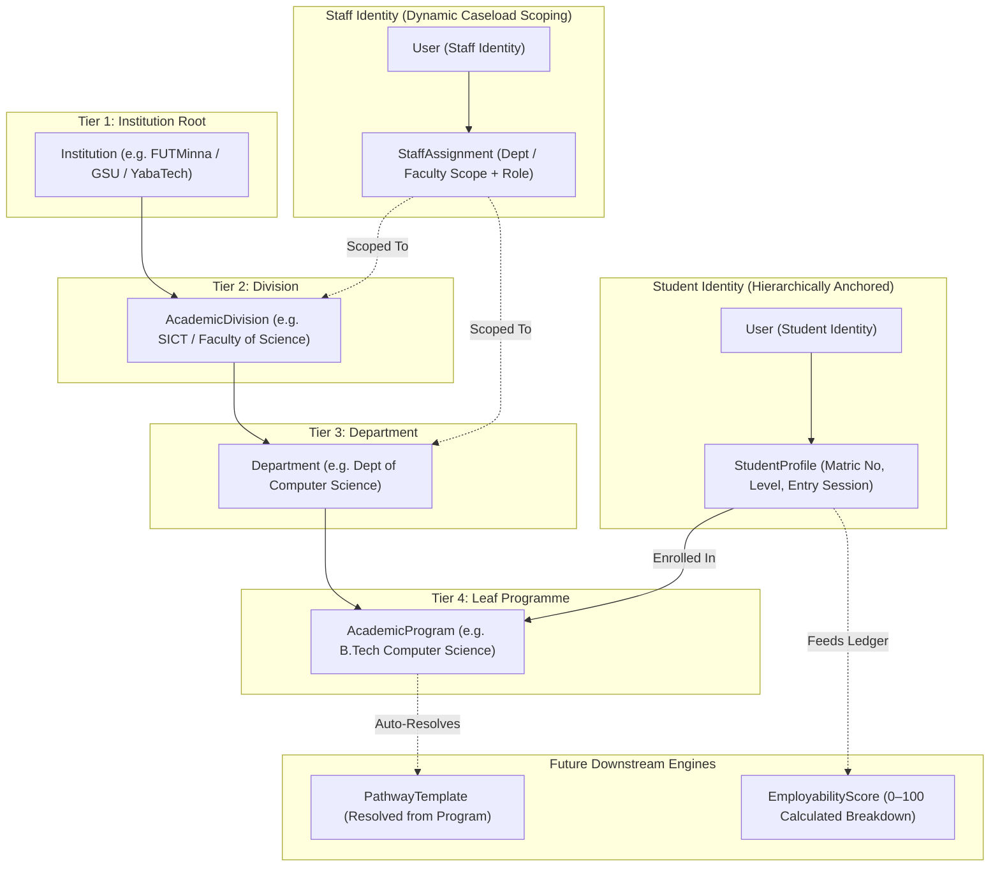
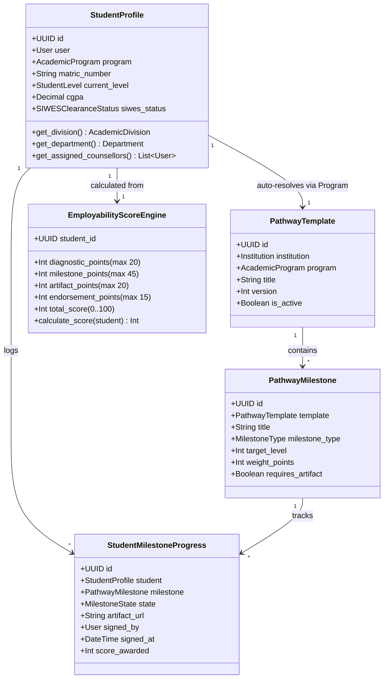
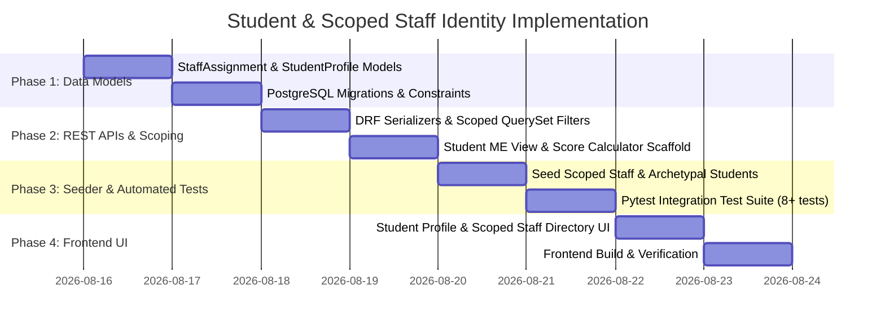

# Edusal Consult — Staff & Student Identity Scaffolding Plan
## Dynamic Departmental Scoping, Hierarchical Student Identity & Pathway Foundation

> **DOCUMENT ID**: `TASKS-ID-STUDENT-001`  
> **STATUS**: ARCHITECTURAL SPECIFICATION & IMPLEMENTATION PLAN  
> **SCOPE**: Staff Departmental Scoping (`StaffAssignment`), Student Identity anchored to Tier-4 (`StudentProfile`), Dynamic Pathway Resolution Scaffold, and Employability Scoring Engine Foundation.

---

## 1. Executive Overview & Problem Statement

### 1.1 The Context & The Flaw of Flat Roles
In Nigerian tertiary institutions (Universities, Polytechnics, Colleges of Education), faculty and student operations are deeply departmentalized:
1. **The Over-Permissioning Trap**: A Career Counsellor at UNILORIN or FUTMinna's *School of Engineering (SEET)* should **not** see or evaluate students from the *School of Agriculture* or *School of Environmental Tech* by default.
2. **The Under-Permissioning Trap**: A single senior professor may serve as **HOD** in one department (e.g. Software Engineering) and simultaneously act as **SIWES Placement Supervisor** for another department (e.g. Computer Science).
3. **The Disconnected Student Record**: A student cannot simply have an `institution_id`. In a NUC/NBTE/NCCE compliant institution, a student's degree option (`AcademicProgram`) deterministically dictates their:
   - Specific **Curriculum Standards** (CCMAS / BMAS / NBTE syllabus)
   - Departmental **SIWES / Industrial Attachment duration** (e.g., 6 months for B.Tech SWE vs. 0 months for B.A. vs. 4 months for ND)
   - Assigned **Faculty Milestone Evaluators** & **Career Counsellor Roster**
   - Active **Employability Pathway Template**



---

## 2. Core Architecture & Data Modeling

### 2.1 Staff Scoping Architecture: `StaffAssignment`
Instead of overloading the `User` model with one-off department columns, staff roles are decoupled into a clean relational model `StaffAssignment`. This supports multi-department responsibilities, primary/secondary appointments, and fine-grained permissions.

```python
class StaffRoleAtUnit(models.TextChoices):
    DEAN = "DEAN", "Dean of Division"
    SUB_DEAN = "SUB_DEAN", "Sub-Dean (Academics / Student Affairs)"
    HOD = "HOD", "Head of Department (HOD)"
    DEPARTMENTAL_COUNSELLOR = "DEPARTMENTAL_COUNSELLOR", "Departmental Career Counsellor"
    FACULTY_COUNSELLOR = "FACULTY_COUNSELLOR", "Faculty Lead Counsellor"
    SIWES_COORDINATOR = "SIWES_COORDINATOR", "Departmental SIWES Coordinator"
    ACADEMIC_ADVISER = "ACADEMIC_ADVISER", "Level Academic Adviser"
    FACULTY_EVALUATOR = "FACULTY_EVALUATOR", "Technical Milestone Evaluator"
    DIRECTOR_CAREER_SERVICES = "DIRECTOR_CAREER_SERVICES", "Director of Career Services (Institution-Wide)"
    SUPERADMIN = "SUPERADMIN", "Institution Superadmin"
```

#### `StaffAssignment` Model Specification:
- `id`: `UUIDField(primary_key=True, default=uuid.uuid4, editable=False)`
- `user`: `ForeignKey(settings.AUTH_USER_MODEL, on_delete=models.CASCADE, related_name="staff_assignments")`
- `institution`: `ForeignKey(Institution, on_delete=models.CASCADE, related_name="staff_assignments")`
- `division`: `ForeignKey(AcademicDivision, null=True, blank=True, on_delete=models.SET_NULL, related_name="staff_assignments")`
  - *If set and `department` is null*: Scopes staff to the **entire Division / Faculty**.
- `department`: `ForeignKey(Department, null=True, blank=True, on_delete=models.SET_NULL, related_name="staff_assignments")`
  - *If set*: Scopes staff to this **specific Department**.
- `role_at_unit`: `CharField(max_length=40, choices=StaffRoleAtUnit.choices)`
- `official_title`: `CharField(max_length=200, blank=True)` (e.g. *"Lead Technical Assessor — Cloud Track"*)
- `assigned_levels`: `JSONField(default=list, blank=True)` (e.g. `[300, 400]` — allows advisers/counsellors to be assigned to specific cohorts).
- `can_evaluate_milestones`: `BooleanField(default=True)` — Permission to sign off student practical evidence.
- `can_manage_waivers`: `BooleanField(default=False)` — Permission to issue prerequisite waivers for SIWES placements.
- `max_caseload`: `PositiveIntegerField(default=100)` — Caseload allocation quota.
- `is_primary`: `BooleanField(default=True)` — Marks primary appointment.
- `is_active`: `BooleanField(default=True)`
- `created_at`, `updated_at`: `DateTimeField`

---

### 2.2 Student Identity Architecture: `StudentProfile`
A student profile is anchored directly to `AcademicProgram` (Tier 4). Because `AcademicProgram` links to `Department` $\rightarrow$ `AcademicDivision` $\rightarrow$ `Institution`, all hierarchical metadata is inherently verifiable and relational.

```python
class StudentLevel(models.TextChoices):
    LEVEL_100 = "100", "100 Level (Year 1 / ND I)"
    LEVEL_200 = "200", "200 Level (Year 2 / ND II / NCE I)"
    LEVEL_300 = "300", "300 Level (Year 3 / HND I / NCE II)"
    LEVEL_400 = "400", "400 Level (Year 4 / HND II / NCE III)"
    LEVEL_500 = "500", "500 Level (Year 5 / Final Year Eng.)"
    LEVEL_600 = "600", "600 Level (Year 6 / Medical)"
    GRADUATED = "GRADUATED", "Graduated (Awaiting NYSC)"
    ALUMNI = "ALUMNI", "Alumni / Post-NYSC"

class EntryMode(models.TextChoices):
    UTME = "UTME", "UTME (Unified Tertiary Matriculation Exam)"
    DIRECT_ENTRY = "DIRECT_ENTRY", "Direct Entry (DE - 200L)"
    TRANSFER = "TRANSFER", "Inter-University / Inter-Faculty Transfer"
    CONVERSION = "CONVERSION", "HND to B.Sc. Conversion"

class AcademicStanding(models.TextChoices):
    IN_GOOD_STANDING = "IN_GOOD_STANDING", "In Good Standing"
    PROBATION = "PROBATION", "Academic Warning / Probation"
    SIWES_SUSPENDED = "SIWES_SUSPENDED", "SIWES Clearance Suspended"
    GRADUATED = "GRADUATED", "Graduated"
    DEFERRED = "DEFERRED", "Session Deferred"

class SIWESClearanceStatus(models.TextChoices):
    NOT_ELIGIBLE = "NOT_ELIGIBLE", "Not Yet Eligible (Pre-SIWES Level)"
    QUALIFYING = "QUALIFYING", "Qualifying (Completing Prerequisite Milestones)"
    CLEARED = "CLEARED", "Cleared by HOD & Coordinator (Ready for Dispatch)"
    ON_ATTACHMENT = "ON_ATTACHMENT", "Active On Attachment"
    COMPLETED = "COMPLETED", "Logbook & Presentation Completed"
```

#### `StudentProfile` Model Specification:
- `id`: `UUIDField(primary_key=True, default=uuid.uuid4, editable=False)`
- `user`: `OneToOneField(settings.AUTH_USER_MODEL, on_delete=models.CASCADE, related_name="student_profile")`
- `institution`: `ForeignKey(Institution, on_delete=models.PROTECT, related_name="students")` (Indexed cache)
- `program`: `ForeignKey(AcademicProgram, on_delete=models.PROTECT, related_name="enrolled_students")`
- `matric_number`: `CharField(max_length=50, db_index=True)` (e.g. `2021/1/74892CS`)
- `jamb_reg_number`: `CharField(max_length=50, blank=True, db_index=True)`
- `entry_session`: `ForeignKey(AcademicSession, on_delete=models.PROTECT, related_name="matriculated_students")`
- `entry_mode`: `CharField(max_length=20, choices=EntryMode.choices, default=EntryMode.UTME)`
- `current_level`: `CharField(max_length=15, choices=StudentLevel.choices, default=StudentLevel.LEVEL_100)`
- `cgpa`: `DecimalField(max_digits=4, decimal_places=2, null=True, blank=True)` (e.g. `4.28`)
- `academic_standing`: `CharField(max_length=30, choices=AcademicStanding.choices, default=AcademicStanding.IN_GOOD_STANDING)`
- `siwes_clearance_status`: `CharField(max_length=30, choices=SIWESClearanceStatus.choices, default=SIWESClearanceStatus.NOT_ELIGIBLE)`
- `phone_number`: `CharField(max_length=30, blank=True)`
- `state_of_origin`: `CharField(max_length=50, blank=True)`
- `gender`: `CharField(max_length=15, blank=True)`
- `bio`: `TextField(blank=True)`
- `portfolio_url`: `URLField(blank=True)` (e.g. GitHub profile / Behance portfolio)
- `linkedin_url`: `URLField(blank=True)`
- `is_verified_student`: `BooleanField(default=True)` (True when matched to institution admissions register)
- `created_at`, `updated_at`: `DateTimeField`

**Constraints & Indexes**:
- `UniqueConstraint(fields=["institution", "matric_number"], name="unique_matric_per_institution")`
- `models.Index(fields=["institution", "current_level"])`
- `models.Index(fields=["program", "current_level"])`

---

## 3. Scaffolding for Downstream Engines (Pathways & EmployabilityScore)



### 3.1 Dynamic Pathway Template Auto-Resolution
When a student is created or navigates to their pathway, the system resolves their active `PathwayTemplate` in cascading priority:
1. **Program-Specific Template**: Template explicitly attached to `student.program` (e.g. *B.Tech Software Engineering Track*).
2. **Departmental Template**: Fallback template attached to `student.program.department` (e.g. *Department of Computer Science Core Track*).
3. **Division Baseline**: Fallback template attached to `student.program.department.division` (e.g. *School of ICT General Technical Baseline*).

### 3.2 The 100-Point Mathematical Scoring Engine Scaffold
The student identity architecture includes explicit methods to calculate their auditable Employability Score in real-time:

$$\text{Total Score (100 pts)} = S_{\text{diag}} (20) + S_{\text{milestones}} (45) + S_{\text{artifacts}} (20) + S_{\text{endorsements}} (15)$$

| Component | Max Points | Verifiable Data Source | Validation Standard |
| :--- | :--- | :--- | :--- |
| **Vocational Diagnostic ($S_{\text{diag}}$)** | **20 pts** | `VocationalDiagnosticRecord` | Holland RIASEC + Technical Aptitude test completed. |
| **Faculty Milestones ($S_{\text{milestones}}$)** | **45 pts** | `StudentMilestoneProgress` | $\frac{\text{Signed Milestones}}{\text{Required Milestones}} \times 45$ signed by named staff. |
| **Practical Artifacts ($S_{\text{artifacts}}$)** | **20 pts** | Evaluated Lab / Capstone Artifact | Code repo, lab design, or project report scored $\ge 70\%$. |
| **Counsellor Endorsement ($S_{\text{endorsements}}$)** | **15 pts** | `CounsellorInterviewRecord` | Work readiness & interview clearance signed by staff. |

---

## 4. QuerySet Scoping & Caseload Security Rules

To enforce departmental boundaries, Django QuerySet filters and DRF Permission classes will automatically filter records based on the user's `StaffAssignment`:

### 4.1 Staff Caseload Scoping Rules
```python
def get_staff_scoped_students(user, institution_id=None):
    """
    Returns StudentProfile QuerySet restricted strictly to the staff member's
    assigned department(s) or faculty/division(s).
    """
    if not user.is_authenticated:
        return StudentProfile.objects.none()

    assignments = user.staff_assignments.filter(is_active=True)
    if not assignments.exists():
        return StudentProfile.objects.none()

    # If user is Superadmin or Director of Career Services -> Full Institution Access
    if assignments.filter(role_at_unit__in=[
        StaffRoleAtUnit.SUPERADMIN, 
        StaffRoleAtUnit.DIRECTOR_CAREER_SERVICES
    ]).exists():
        inst_id = assignments.first().institution_id
        return StudentProfile.objects.filter(institution_id=inst_id)

    # Compile scoped divisions and departments
    scoped_division_ids = assignments.filter(department__isnull=True).values_list("division_id", flat=True)
    scoped_department_ids = assignments.filter(department__isnull=False).values_list("department_id", flat=True)

    q_filter = Q(program__department_id__in=scoped_department_ids) | Q(program__department__division_id__in=scoped_division_ids)
    return StudentProfile.objects.filter(q_filter).select_related("user", "program", "program__department", "institution")
```

---

## 5. REST API Endpoints Specification

### 5.1 Staff Assignment Endpoints (`/api/staff-assignments/`)
- `GET /api/staff-assignments/`: Lists staff assignments (filtered by `institution`, `division`, `department`, or `role`).
- `POST /api/staff-assignments/`: Assigns a staff member to a department/division with roles and evaluation permissions.
- `GET /api/staff-assignments/my-caseload/`: Returns currently logged-in staff member's assigned departments, student count, and pending milestone reviews.

### 5.2 Student Profile Endpoints (`/api/students/`)
- `GET /api/students/`: Lists students (scoped strictly to staff member's assigned departments).
- `POST /api/students/`: Creates a student account & profile anchored to `AcademicProgram`.
- `GET /api/students/{id}/`: Detailed student view with program hierarchy, level, and academic standing.
- `GET /api/students/me/`: Returns current logged-in student's complete profile, program tree, and milestone progress.
- `GET /api/students/{id}/employability-score/`: Returns the 0–100 score with full explainability breakdown.

---

## 6. Seed Accounts & Test Cohort Matrix

All accounts will use the standardized test password: **`1234!@#$`**

### 6.1 Scoped Staff Seed Accounts:
1. **Dean SICT (FUTMinna)**: `dean.sict@futminna.edu.ng` (Scoped to SICT division — sees SWE & CSC students).
2. **HOD Software Engineering (FUTMinna)**: `hod.swe@futminna.edu.ng` (Scoped strictly to SWE department).
3. **Counsellor (YabaTech)**: `counsellor.tech@yabatech.edu.ng` (Scoped to Computer Technology department).
4. **HOD Math/CS (FCE Zaria)**: `hod.maths@fcezaria.edu.ng` (Scoped strictly to Mathematics Education).

### 6.2 Archetypal Student Seed Accounts:
1. **Chidinma Okafor (FUTMinna)**:
   - Email: `student.swe@futminna.edu.ng`
   - Program: *B.Tech Software Engineering* (Tier 4)
   - Dept: *Software Engineering* (Tier 3) $\rightarrow$ Div: *School of ICT* (Tier 2)
   - Level: 300 Level · Entry: 2023/2024 · CGPA: 4.35 · SIWES Status: Qualifying
2. **Ibrahim Danladi (GSU)**:
   - Email: `student.cs@gsu.edu.ng`
   - Program: *B.Sc. Computer Science* (Tier 4)
   - Dept: *Computer Science* (Tier 3) $\rightarrow$ Div: *Faculty of Science* (Tier 2)
   - Level: 200 Level · Entry: 2024/2025 · CGPA: 3.80
3. **Babatunde Adeleke (YabaTech)**:
   - Email: `student.nd@yabatech.edu.ng`
   - Program: *National Diploma (ND) Computer Science* (Tier 4)
   - Dept: *Computer Technology* (Tier 3) $\rightarrow$ Div: *School of Technology* (Tier 2)
   - Level: 200 Level (ND II) · SIWES Status: Qualifying (4 Months attachment)
4. **Fatima Garba (FCE Zaria)**:
   - Email: `student.nce@fcezaria.edu.ng`
   - Program: *NCE Mathematics / Computer Science Combination* (Tier 4)
   - Dept: *Mathematics Education* (Tier 3) $\rightarrow$ Div: *School of Sciences* (Tier 2)
   - Level: 300 Level (NCE III) · Teaching Practice Eligible

---

## 7. Phased Implementation Roadmap



### Step-by-Step Execution Plan:

1. **Step 1: Backend Models (`backend/edusal/institutions/models.py` or new `identity` app)**:
   - Create `StaffAssignment` model with unit scoping (`division`, `department`, `role_at_unit`, `assigned_levels`).
   - Create `StudentProfile` model anchored to `AcademicProgram` with matric number uniqueness constraint.
   - Run `python manage.py makemigrations` and `python manage.py migrate`.

2. **Step 2: Scoped QuerySets & DRF Serializers**:
   - Create `StaffAssignmentSerializer` and `StudentProfileSerializer` (with full hierarchy expansion: Program $\rightarrow$ Dept $\rightarrow$ Division $\rightarrow$ Institution).
   - Create `StaffAssignmentViewSet` and `StudentProfileViewSet`.
   - Implement `get_queryset()` scoping logic so counsellors/HODs only receive students in their assigned unit.

3. **Step 3: Seeder Expansion**:
   - Update `seed_institutions.py` to seed both scoped staff and realistic students across all 4 archetypes (FUTMinna, GSU, YabaTech, FCE Zaria) with password `'1234!@#$'`.

4. **Step 4: Pytest Test Suite**:
   - Write comprehensive tests in `backend/edusal/institutions/tests/test_student_identity.py`:
     - Test student creation linked to `AcademicProgram`.
     - Test matric number uniqueness per institution.
     - Test counsellor scoping (engineering counsellor cannot query agriculture students).
     - Test student `/api/students/me/` endpoint.

5. **Step 5: Frontend UI & TypeScript Types**:
   - Update `frontend/src/types/` with `StudentProfile`, `StaffAssignment`, `StudentLevel`.
   - Add student roster tab in the Institutional Dashboard (filtered by active staff unit).
   - Add Student Identity Card & Program Path breadcrumb component.
   - Run `npm run build` and push to GitHub.

---

## 8. Verification & Acceptance Criteria

| Checkpoint | Target Standard | Verification Command |
| :--- | :--- | :--- |
| **1. Program Anchoring** | Student links directly to Tier-4 `AcademicProgram` | `student.program.department.division.institution` resolves cleanly |
| **2. Scoped Security** | Engineering staff cannot query Agric students | Pytest test case `test_departmental_scoping_isolation` passes |
| **3. Matric Uniqueness** | Same matric number rejected in same institution | DB `UniqueConstraint` verified with IntegrityError test |
| **4. Zero Emojis** | Pure SVG icons from `icons/index.tsx` | Grep emoji scanner confirms 0 emojis |
| **5. Build & Tests** | Pytest 100% pass & Frontend 0 TypeScript errors | `pytest` + `npm run build` exit code 0 |
