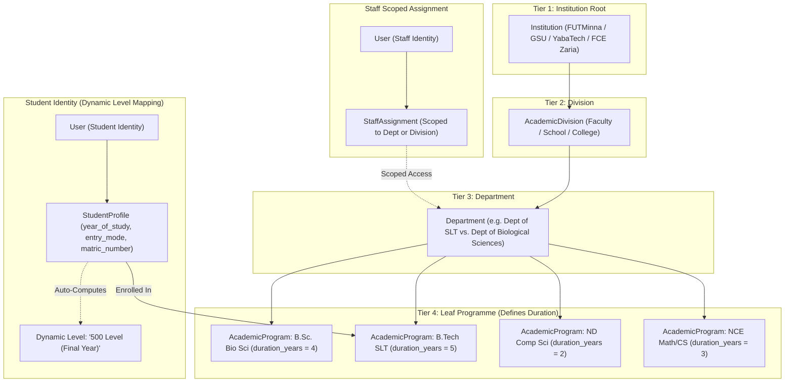

# Nexus Edutech Consult Ltd — Staff & Student Identity Implementation Plan
## Dynamic Departmental Scoping & Program-Driven Dynamic Student Identity

> **DOCUMENT ID**: `TASKS-ID-STUDENT-001-REV2`  
> **STATUS**: REVISED ARCHITECTURAL PLAN  
> **CORE SCOPE**: 
> 1. Staff Departmental Scoping (`StaffAssignment`)
> 2. Program-Driven Dynamic Student Identity (`StudentProfile`) with dynamic multi-year progression (4-yr B.Sc, 5-yr SLT/B.Tech, 2-yr ND/HND, 3-yr NCE, 6-yr Med)
> 3. Scoped Caseload Filtering & REST APIs
> 4. Seeders, Pytest Test Suite, and Frontend Scoped Management & Student Roster UI
> 
> *(Note: Pathways and Employability Scoring Engine are excluded from this implementation and reserved for subsequent phases).*

---

## 1. Executive Overview & Architectural Motivation

### 1.1 The Context: Real-World Departmental & Academic Differences
In Nigerian tertiary institutions (Universities, Polytechnics, Colleges of Education), institutions exhibit diverse departmental structures:
1. **Departmental Scoping for Staff**:
   - A Career Counsellor or Faculty Supervisor at UNILORIN / FUTMinna's *School of ICT* or *Faculty of Science* must only manage their assigned departments (e.g., Computer Science / Software Engineering) and cannot see or modify students in Agriculture or Environmental Tech.
   - A single staff member can hold distinct roles in different units (e.g. HOD in Software Engineering, while simultaneously serving as SIWES Coordinator for Cyber Security).
2. **Program-Driven Dynamic Student Levels**:
   - Within the **same Faculty of Science**, *B.Sc. Biological Science* has a **4-year duration**, while *B.Tech. Science Laboratory Technology (SLT)* has a **5-year duration**.
   - In Polytechnics, *National Diploma (ND)* is **2 years** (`ND I`, `ND II`), and *Higher National Diploma (HND)* is **2 years** (`HND I`, `HND II`).
   - In Colleges of Education, *NCE* programs are **3 years** (`NCE I`, `NCE II`, `NCE III`).
   - In Medical / Pharmaceutical schools, programs span **6 years** (`100` through `600 Level`).
   - **Requirement**: Student level must **not** be a rigid, static enum. It must dynamically derive from the program's `duration_years`, the institution's archetype, and the student's entry mode (`UTME` starts at Year 1, `DIRECT_ENTRY` starts at Year 2).



---

## 2. Relational Data Models Specification

### 2.1 Staff Scoping Architecture: `StaffAssignment`
Staff roles and permissions are decoupled into `StaffAssignment`, linking a `User` to an `Institution`, optional `AcademicDivision`, and optional `Department`.

```python
class StaffRoleAtUnit(models.TextChoices):
    DEAN = "DEAN", "Dean of Division"
    SUB_DEAN = "SUB_DEAN", "Sub-Dean (Academics / Student Affairs)"
    HOD = "HOD", "Head of Department (HOD)"
    DEPARTMENTAL_COUNSELLOR = "DEPARTMENTAL_COUNSELLOR", "Departmental Career Counsellor"
    FACULTY_COUNSELLOR = "FACULTY_COUNSELLOR", "Faculty Lead Counsellor"
    SIWES_COORDINATOR = "SIWES_COORDINATOR", "Departmental SIWES Coordinator"
    ACADEMIC_ADVISER = "ACADEMIC_ADVISER", "Level Academic Adviser"
    FACULTY_EVALUATOR = "FACULTY_EVALUATOR", "Technical Milestone Evaluator"
    DIRECTOR_CAREER_SERVICES = "DIRECTOR_CAREER_SERVICES", "Director of Career Services (Institution-Wide)"
    SUPERADMIN = "SUPERADMIN", "Institution Superadmin"
```

#### Fields in `StaffAssignment`:
- `id`: `UUIDField(primary_key=True, default=uuid.uuid4, editable=False)`
- `user`: `ForeignKey(settings.AUTH_USER_MODEL, on_delete=models.CASCADE, related_name="staff_assignments")`
- `institution`: `ForeignKey(Institution, on_delete=models.CASCADE, related_name="staff_assignments")`
- `division`: `ForeignKey(AcademicDivision, null=True, blank=True, on_delete=models.SET_NULL, related_name="staff_assignments")`
- `department`: `ForeignKey(Department, null=True, blank=True, on_delete=models.SET_NULL, related_name="staff_assignments")`
- `role_at_unit`: `CharField(max_length=40, choices=StaffRoleAtUnit.choices)`
- `official_title`: `CharField(max_length=200, blank=True)` (e.g. *"Academic Adviser — 300L SLT Track"*)
- `assigned_years_of_study`: `JSONField(default=list, blank=True)` (e.g. `[3, 4, 5]` — restricts counsellor/adviser to specific cohorts)
- `can_evaluate_milestones`: `BooleanField(default=True)`
- `can_manage_waivers`: `BooleanField(default=False)`
- `max_caseload`: `PositiveIntegerField(default=150)`
- `is_primary`: `BooleanField(default=True)`
- `is_active`: `BooleanField(default=True)`
- `created_at`, `updated_at`: `DateTimeField`

---

### 2.2 Dynamic Program-Driven Student Identity: `StudentProfile`

#### Core Program-Driven Level Logic
Instead of a rigid enum that fails across 4-year vs 5-year vs 2-year programs, the student profile tracks:
1. `year_of_study`: `PositiveSmallIntegerField(default=1)` (1, 2, 3, 4, 5, 6)
2. `is_spillover`: `BooleanField(default=False)` (For students extending beyond standard duration)
3. Dynamic computation methods on `StudentProfile`:
   - `get_level_code()`: Returns string code (e.g. `"100"`, `"200"`, `"300"`, `"400"`, `"500"`, `"600"`, `"ND_I"`, `"ND_II"`, `"HND_I"`, `"HND_II"`, `"NCE_I"`, `"NCE_II"`, `"NCE_III"`).
   - `get_level_display()`: Returns human label (e.g. `"500 Level (Final Year)"` for SLT/B.Tech, `"400 Level (Final Year)"` for Bio Sci, `"ND II (Final Year)"` for Polytechnic ND, `"NCE III (Final Year)"` for College of Ed).
   - `is_final_year`: Returns `year_of_study >= program.duration_years`.
   - `is_siwes_year`: Compares `year_of_study` with `program.siwes_target_year` (typically Year 3 in 4-yr, Year 4 in 5-yr, Year 1 in 2-yr ND).

```python
class EntryMode(models.TextChoices):
    UTME = "UTME", "UTME (Standard Entry - Year 1)"
    DIRECT_ENTRY = "DIRECT_ENTRY", "Direct Entry (DE - Year 2)"
    TRANSFER = "TRANSFER", "Inter-Faculty / University Transfer"
    CONVERSION = "CONVERSION", "HND to B.Sc. Conversion"

class AcademicStanding(models.TextChoices):
    IN_GOOD_STANDING = "IN_GOOD_STANDING", "In Good Standing"
    PROBATION = "PROBATION", "Academic Warning / Probation"
    SIWES_SUSPENDED = "SIWES_SUSPENDED", "SIWES Clearance Suspended"
    GRADUATED = "GRADUATED", "Graduated (Awaiting NYSC)"
    ALUMNI = "ALUMNI", "Alumni / Post-NYSC"
    DEFERRED = "DEFERRED", "Session Deferred"

class SIWESClearanceStatus(models.TextChoices):
    NOT_ELIGIBLE = "NOT_ELIGIBLE", "Not Yet Eligible (Pre-SIWES Year)"
    QUALIFYING = "QUALIFYING", "Qualifying (Prerequisites in Progress)"
    CLEARED = "CLEARED", "Cleared by HOD & Coordinator (Ready for Placement)"
    ON_ATTACHMENT = "ON_ATTACHMENT", "Active On Attachment"
    COMPLETED = "COMPLETED", "Attachment Logbook & Presentation Completed"
```

#### Fields in `StudentProfile`:
- `id`: `UUIDField(primary_key=True, default=uuid.uuid4, editable=False)`
- `user`: `OneToOneField(settings.AUTH_USER_MODEL, on_delete=models.CASCADE, related_name="student_profile")`
- `institution`: `ForeignKey(Institution, on_delete=models.PROTECT, related_name="students")` (Indexed cache)
- `program`: `ForeignKey(AcademicProgram, on_delete=models.PROTECT, related_name="enrolled_students")`
- `matric_number`: `CharField(max_length=50, db_index=True)` (e.g. `2021/1/74892CS` or `GSU/SCI/CSC/22/0104`)
- `jamb_reg_number`: `CharField(max_length=50, blank=True, db_index=True)`
- `entry_session`: `ForeignKey(AcademicSession, on_delete=models.PROTECT, related_name="matriculated_students")`
- `entry_mode`: `CharField(max_length=20, choices=EntryMode.choices, default=EntryMode.UTME)`
- `year_of_study`: `PositiveSmallIntegerField(default=1)` (1 to 6)
- `is_spillover`: `BooleanField(default=False)`
- `cgpa`: `DecimalField(max_digits=4, decimal_places=2, null=True, blank=True)`
- `academic_standing`: `CharField(max_length=30, choices=AcademicStanding.choices, default=AcademicStanding.IN_GOOD_STANDING)`
- `siwes_clearance_status`: `CharField(max_length=30, choices=SIWESClearanceStatus.choices, default=SIWESClearanceStatus.NOT_ELIGIBLE)`
- `phone_number`: `CharField(max_length=30, blank=True)`
- `state_of_origin`: `CharField(max_length=50, blank=True)`
- `gender`: `CharField(max_length=15, blank=True)`
- `bio`: `TextField(blank=True)`
- `portfolio_url`: `URLField(blank=True)`
- `linkedin_url`: `URLField(blank=True)`
- `is_verified_student`: `BooleanField(default=True)`
- `created_at`, `updated_at`: `DateTimeField`

**Database Constraints & Indexes**:
- `UniqueConstraint(fields=["institution", "matric_number"], name="unique_matric_per_institution")`
- `Index(fields=["institution", "year_of_study"])`
- `Index(fields=["program", "year_of_study"])`

---

## 3. Dynamic Level Mapping Matrix Across Archetypes

| Program Type | Example Degree | `duration_years` | Year 1 | Year 2 | Year 3 | Year 4 | Year 5 | Year 6 |
| :--- | :--- | :---: | :---: | :---: | :---: | :---: | :---: | :---: |
| **University 4-Year** | B.Sc. Biological Science | **4** | 100 Level | 200 Level | 300 Level *(SIWES)* | 400 Level *(Final)* | — | — |
| **University 5-Year** | B.Tech SLT / Software Eng | **5** | 100 Level | 200 Level | 300 Level | 400 Level *(SIWES)* | 500 Level *(Final)* | — |
| **University 6-Year** | MBBS / PharmD / DVM | **6** | 100 Level | 200 Level | 300 Level | 400 Level | 500 Level | 600 Level *(Final)* |
| **Polytechnic ND** | ND Computer Science | **2** | ND I | ND II *(SIWES/Final)* | — | — | — | — |
| **Polytechnic HND** | HND Software Engineering | **2** | HND I | HND II *(Final)* | — | — | — | — |
| **College of Ed NCE** | NCE Math / CS Combination | **3** | NCE I | NCE II | NCE III *(TP/Final)* | — | — | — |

---

## 4. QuerySet Scoping & Departmental Caseload Rules

To enforce departmental boundaries and prevent cross-faculty data exposure:

```python
def get_staff_scoped_students(user, institution_id=None):
    """
    Returns StudentProfile QuerySet restricted strictly to the staff member's
    assigned department(s) or faculty/division(s).
    """
    if not user.is_authenticated:
        return StudentProfile.objects.none()

    assignments = user.staff_assignments.filter(is_active=True)
    if not assignments.exists():
        return StudentProfile.objects.none()

    # Superadmin or Director of Career Services -> Full Institution Access
    if assignments.filter(role_at_unit__in=[
        StaffRoleAtUnit.SUPERADMIN, 
        StaffRoleAtUnit.DIRECTOR_CAREER_SERVICES
    ]).exists():
        inst_id = assignments.first().institution_id
        return StudentProfile.objects.filter(institution_id=inst_id)

    # Scoped Divisions (e.g. Deans) and Scoped Departments (e.g. HODs, Counsellors)
    scoped_division_ids = assignments.filter(department__isnull=True).values_list("division_id", flat=True)
    scoped_department_ids = assignments.filter(department__isnull=False).values_list("department_id", flat=True)

    q_filter = Q(program__department_id__in=scoped_department_ids) | Q(program__department__division_id__in=scoped_division_ids)
    
    qs = StudentProfile.objects.filter(q_filter)
    if institution_id:
        qs = qs.filter(institution_id=institution_id)
        
    return qs.select_related("user", "program", "program__department", "program__department__division", "institution")
```

---

## 5. REST API Endpoints Specification

### 5.1 Staff Assignment Endpoints (`/api/staff-assignments/`)
- `GET /api/staff-assignments/`: Lists staff assignments filtered by institution.
- `POST /api/staff-assignments/`: Creates a staff assignment with unit scope and roles.
- `GET /api/staff-assignments/my-caseload/`: Returns currently logged-in staff member's assigned units, student count, and SIWES candidates.

### 5.2 Student Profile Endpoints (`/api/students/`)
- `GET /api/students/`: Lists students (scoped strictly to staff member's assigned departments).
- `POST /api/students/`: Creates a student account & profile with automatic level computation from `AcademicProgram`.
- `GET /api/students/{id}/`: Detailed student view with program hierarchy, year of study, dynamic level display, and SIWES status.
- `GET /api/students/me/`: Returns current logged-in student's full profile and program tree.

---

## 6. Seed Accounts & Test Scenarios

All accounts use the standard test password: **`1234!@#$`**

### 6.1 Scoped Staff Seed Accounts:
1. **Dean SICT (FUTMinna)**: `dean.sict@futminna.edu.ng` (Scoped to SICT division — sees SWE & CSC students).
2. **HOD Software Engineering (FUTMinna)**: `hod.swe@futminna.edu.ng` (Scoped strictly to SWE department).
3. **Counsellor (GSU)**: `counsellor.sci@gsu.edu.ng` (Scoped to Faculty of Science).
4. **HOD Computer Technology (YabaTech)**: `hod.ct@yabatech.edu.ng` (Scoped strictly to Computer Technology department).
5. **HOD Math Education (FCE Zaria)**: `hod.maths@fcezaria.edu.ng` (Scoped strictly to Mathematics Education).

### 6.2 Diverse Program Duration Student Seed Accounts:
1. **Amina Bello (FUTMinna - 5-Year SLT/B.Tech)**:
   - Email: `student.swe@futminna.edu.ng`
   - Program: *B.Tech Software Engineering* (`duration_years = 5`)
   - `year_of_study = 4` $\rightarrow$ Dynamic Level: **`400 Level (SIWES Qualifying)`**
2. **Chinedu Eze (GSU - 4-Year B.Sc)**:
   - Email: `student.cs@gsu.edu.ng`
   - Program: *B.Sc. Computer Science* (`duration_years = 4`)
   - `year_of_study = 4` $\rightarrow$ Dynamic Level: **`400 Level (Final Year)`**
3. **Babatunde Adeleke (YabaTech - 2-Year ND)**:
   - Email: `student.nd@yabatech.edu.ng`
   - Program: *National Diploma (ND) Computer Science* (`duration_years = 2`)
   - `year_of_study = 2` $\rightarrow$ Dynamic Level: **`ND II (Final Year / SIWES)`**
4. **Fatima Garba (FCE Zaria - 3-Year NCE)**:
   - Email: `student.nce@fcezaria.edu.ng`
   - Program: *NCE Mathematics / Computer Science* (`duration_years = 3`)
   - `year_of_study = 3` $\rightarrow$ Dynamic Level: **`NCE III (Final Year / Teaching Practice)`**

---

## 7. Phased Implementation Steps

### Phase 1: Backend Data Models & Migrations
- Implement `StaffAssignment` and `StudentProfile` in `backend/nexus/institutions/models.py`.
- Add dynamic level calculation methods (`get_level_code()`, `get_level_display()`, `is_final_year`).
- Run Django migrations.

### Phase 2: REST APIs & Scoping Logic
- Create `StaffAssignmentSerializer`, `StudentProfileSerializer`, `StudentCreateSerializer`.
- Implement `StaffAssignmentViewSet` and `StudentProfileViewSet` with `get_staff_scoped_students()` filter.
- Register routes in `config/api_router.py`.

### Phase 3: Seeder Expansion & Pytest Test Suite
- Expand `seed_institutions.py` to seed scoped staff and diverse multi-year duration students.
- Write tests in `backend/nexus/institutions/tests/test_student_identity.py` covering:
  - Dynamic level resolution (4-yr vs 5-yr vs 2-yr ND vs 3-yr NCE).
  - Departmental scoping security (SEET staff cannot query Agric or Arts students).
  - Matric number uniqueness per institution.
  - Student creation and retrieve endpoints.

### Phase 4: Frontend Scoped Staff Directory & Student Roster
- Add TypeScript interfaces (`StudentProfile`, `StaffAssignment`) in `frontend/src/types/institution.ts`.
- Add `StudentRoster.tsx` component in the Institutional Dashboard (showing matric number, program, dynamic level tag, entry mode, SIWES status, with modal to register student).
- Add 5th tab to `InstitutionDashboard.tsx` ("Student Directory & Roster").
- Run `npm run build` and push to GitHub.
