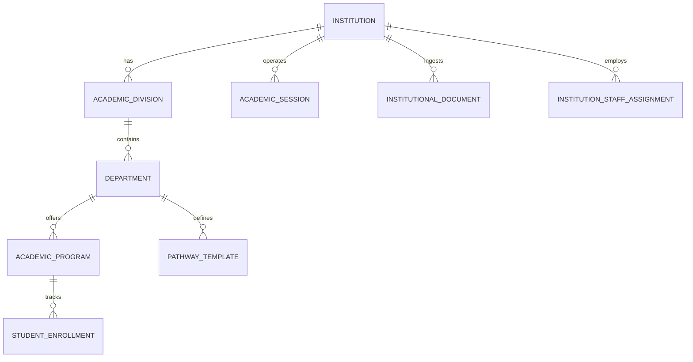
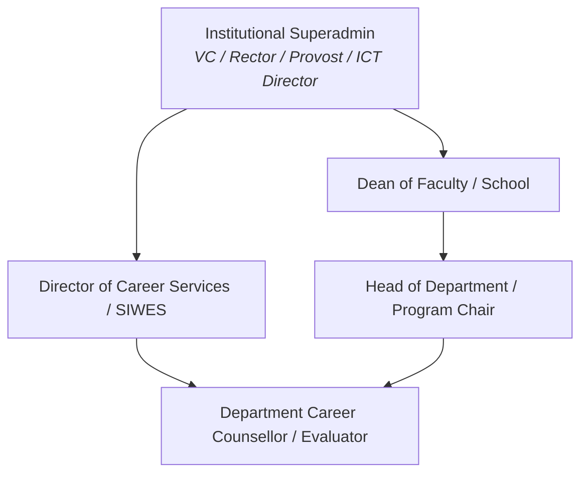
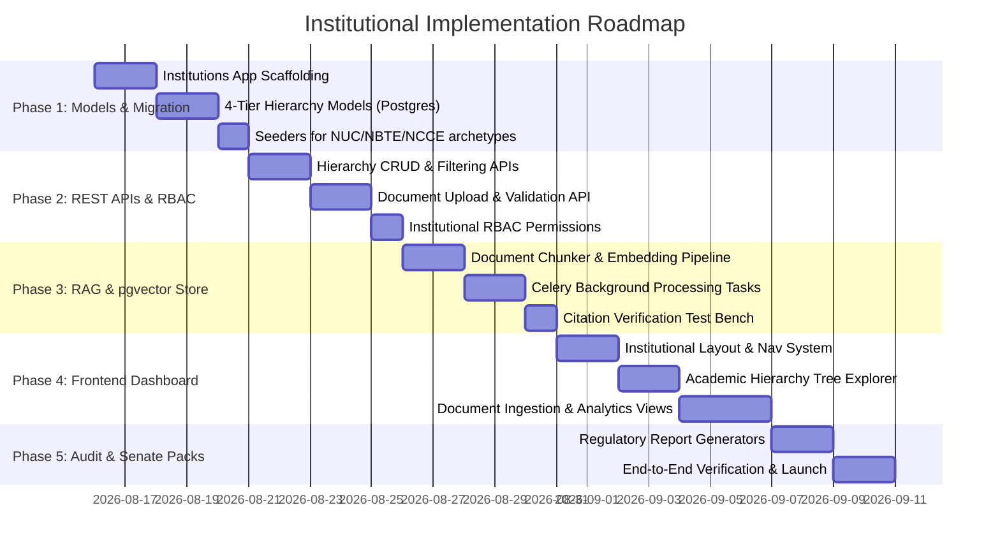

# Edusal Consult — Institutional Architecture & Implementation Plan

> **Scope:** Multi-Tenant Institutional Hierarchy, Governance Engine, Academic Directory, Document Grounding (RAG), and Executive Dashboard for Nigerian Tertiary Institutions (NUC Universities, NBTE Polytechnics, NCCE Colleges of Education).
>
> **Target File:** `tasks/institution.md`

---

## 1. Executive Summary & Regulatory Foundation

In **Edusal Consult**, the **Institution** is the primary organizational tenant, regulatory boundary, and trust root. Every student, counsellor, faculty evaluator, and institutional document belongs to an institution. 

The institutional layer must accommodate the structural realities and statutory terminologies of Nigeria’s three principal higher education regulatory bodies:

1. **National Universities Commission (NUC):** Universities structured into Faculties/Colleges, Departments, and Degree Programmes (B.Sc., B.Eng., B.A., LL.B., etc.).
2. **National Board for Technical Education (NBTE):** Polytechnics and Monotechnics structured into Schools, Departments, and National Diploma (ND) / Higher National Diploma (HND) programmes.
3. **National Commission for Colleges of Education (NCCE):** Colleges of Education structured into Schools, Departments, and Nigeria Certificate in Education (NCE) subject combinations/double majors.

---

## 2. Universal 4-Tier Academic Hierarchy

To maintain a clean, standardized database schema while honoring each institution type’s native nomenclature, Edusal uses a **Polymorphic 4-Tier Hierarchy**:

```mermaid
graph TD
    subgraph Tier 1: Institutional Root
        Inst[Institution / Tenant]
    end

    subgraph Tier 2: Academic Division
        Div[Academic Division<br/><i>'Faculty' in Univs | 'School' in Poly/COE | 'College' in Med/Agric</i>]
    end

    subgraph Tier 3: Departmental Unit
        Dept[Academic Department<br/><i>e.g. Dept of Mathematics / Computer Science</i>]
    end

    subgraph Tier 4: Leaf Degree / Programme
        Prog[Academic Programme / Degree Option<br/><i>e.g. B.Sc. Software Eng | ND Statistics | NCE Maths/Physics</i>]
    end

    Inst --> Div
    Div --> Dept
    Dept --> Prog
```

### Regulatory Hierarchy Mapping

| Regulatory Body | Tier 1 (Institution) | Tier 2 (Academic Division) | Tier 3 (Department) | Tier 4 (Programme / Degree Option) |
|---|---|---|---|---|
| **NUC** (Universities) | University *(e.g. FUTMinna)* | **Faculty** or **College** *(e.g. School of ICT / College of Medicine)* | **Department** *(e.g. Dept of Software Engineering)* | **Degree Programme** *(e.g. B.Tech Software Engineering)* |
| **NBTE** (Polytechnics) | Polytechnic *(e.g. YabaTech)* | **School** *(e.g. School of Applied Sciences)* | **Department** *(e.g. Dept of Computer Science)* | **Diploma Option** *(e.g. ND Computer Science, HND Software Track)* |
| **NCCE** (Colleges of Ed.) | College of Education *(e.g. FCE Zaria)* | **School** *(e.g. School of Sciences)* | **Department** *(e.g. Dept of Mathematics)* | **Subject Combination** *(e.g. NCE Mathematics / Physics combination)* |

---

## 3. Data Models Schema (Django & PostgreSQL)

The institutional subsystem will be housed under `backend/edusal/institutions/`.



### Core Model Specifications

#### 1. `Institution`
* `id` (UUID, PK)
* `name` (CharField: e.g. "Federal University of Technology, Minna")
* `short_name` / `acronym` (CharField: e.g. "FUTMinna")
* `slug` (SlugField, unique)
* `institution_type` (Enum: `UNIVERSITY`, `POLYTECHNIC`, `COLLEGE_OF_EDUCATION`, `MONOTECHNIC`)
* `ownership` (Enum: `FEDERAL`, `STATE`, `PRIVATE`)
* `regulator` (Enum: `NUC`, `NBTE`, `NCCE`)
* `tier_two_term` (Enum: `FACULTY`, `SCHOOL`, `COLLEGE` — dynamic UI label)
* `logo` (ImageField)
* `domain_whitelist` (JSONField: e.g. `["@futminna.edu.ng"]`)
* `address`, `state`, `geo_coordinates`
* `is_founding_partner` (BooleanField)
* `status` (Enum: `ACTIVE`, `PROVISIONING`, `SUSPENDED`)
* `created_at`, `updated_at`

#### 2. `AcademicDivision` (Faculty / School / College)
* `id` (UUID, PK)
* `institution` (ForeignKey -> `Institution`, related_name="divisions")
* `name` (CharField: e.g. "School of Information and Communication Technology")
* `code` (CharField: e.g. "SICT")
* `division_type` (Enum: `FACULTY`, `SCHOOL`, `COLLEGE`)
* `dean_name`, `dean_email`
* `is_active` (BooleanField)

#### 3. `Department`
* `id` (UUID, PK)
* `institution` (ForeignKey -> `Institution`)
* `division` (ForeignKey -> `AcademicDivision`, related_name="departments")
* `name` (CharField: e.g. "Department of Software Engineering")
* `code` (CharField: e.g. "SWE")
* `hod_name`, `hod_email`
* `siwes_eligible` (BooleanField — indicates if students participate in 300L/400L SIWES)
* `is_active` (BooleanField)

#### 4. `AcademicProgram` (Degree / Course / Combination)
* `id` (UUID, PK)
* `institution` (ForeignKey -> `Institution`)
* `department` (ForeignKey -> `Department`, related_name="programs")
* `name` (CharField: e.g. "B.Tech Software Engineering")
* `program_code` (CharField: e.g. "SWE-BTECH")
* `award_level` (Enum: `BSC`, `BTECH`, `BENG`, `BA`, `LLB`, `ND`, `HND`, `NCE`, `PGD`, `MSC`)
* `duration_years` (IntegerField: e.g. 5 for Engineering, 2 for ND, 3 for NCE)
* `siwes_duration_months` (IntegerField: e.g. 6 months)
* `is_active` (BooleanField)

#### 5. `AcademicSession` & `Semester`
* `id` (UUID, PK)
* `institution` (ForeignKey -> `Institution`, related_name="sessions")
* `session_label` (CharField: e.g. "2025/2026")
* `start_date`, `end_date`
* `current_semester` (Enum: `FIRST_SEMESTER`, `SECOND_SEMESTER`)
* `is_current` (BooleanField)

#### 6. `InstitutionalDocument` (For pgvector Grounding)
* `id` (UUID, PK)
* `institution` (ForeignKey -> `Institution`)
* `division` (ForeignKey -> `AcademicDivision`, null=True, blank=True)
* `department` (ForeignKey -> `Department`, null=True, blank=True)
* `title` (CharField: e.g. "FUTMinna 2025/2026 SIWES Operational Guidelines")
* `doc_type` (Enum: `STUDENT_HANDBOOK`, `SIWES_CALENDAR`, `CURRICULUM_BMAS`, `EMPLOYER_BRIEF`, `POLICY`)
* `file` (FileField: PDF, DOCX)
* `content_hash` (CharField: sha256)
* `chunk_count` (IntegerField)
* `embedding_status` (Enum: `PENDING`, `INDEXED`, `FAILED`)
* `created_at`

#### 7. `InstitutionalDocumentChunk` (pgvector store)
* `id` (UUID, PK)
* `document` (ForeignKey -> `InstitutionalDocument`, on_delete=CASCADE)
* `chunk_index` (IntegerField)
* `page_number` (IntegerField)
* `section_reference` (CharField: e.g. "Section 4.2: Placement Prerequisites")
* `content` (TextField)
* `embedding` (`VectorField(dimensions=1536)` — PostgreSQL pgvector)

---

## 4. Role-Based Access Control (RBAC) in Institutions



| Role | Scope | Key Permissions |
|---|---|---|
| **Institution Superadmin** | Whole Institution | Manage academic divisions, sessions, institutional branding, export senate audits, administer roles. |
| **Director of Career Services** | Cross-Faculty | Ingest SIWES guidelines, monitor university-wide employability indices, approve employer pipeline briefs. |
| **Dean of Faculty / School** | Division Level | Review faculty departmental performance, benchmark placement compliance, audit evaluator sign-offs. |
| **Head of Department (HOD)** | Department Level | Co-design department pathway templates, assign faculty evaluators, sign off on major capstones. |
| **Faculty Counsellor / Evaluator**| Department / Cohort | Review student submissions, evaluate milestone artifacts, handle AI assistant handoffs. |

---

## 5. Institutional Dashboard Modules (Frontend Specification)

The Institutional Dashboard (`/institution/*`) provides a dedicated, high-security operational interface for university and polytechnic administrators.

### Core Dashboard Views:

1. **Executive Overview & Governance Pulse (`/institution/dashboard`)**
   * Institutional employability index rollup across all faculties.
   * Real-time SIWES readiness pipeline (Students eligible vs. verified vs. placed).
   * Verifiable evidence status (Named evaluator sign-off throughput).
   * Regulatory readiness gauge (NUC / NBTE accreditation compliance checklist).

2. **Academic Structure & Hierarchy Manager (`/institution/structure`)**
   * Visual tree-explorer: Institution ➔ Faculties/Schools ➔ Departments ➔ Programmes.
   * Add/Edit divisions and departments with dynamic terminology based on institution type.
   * Program duration, award level (B.Tech, HND, NCE), and SIWES cycle settings.

3. **Document Ingestion & Knowledge Base Center (`/institution/documents`)**
   * Upload official PDF handbooks, SIWES calendars, and departmental briefs.
   * Real-time embedding and chunking status with pgvector verification.
   * **Citation Test Bench:** Test queries against ingested documents with exact page citations and confidence scores.

4. **Staff & Evaluator Caseload Directory (`/institution/staff`)**
   * Directory of Deans, HODs, and assigned Career Counsellors.
   * Caseload quotas, pending milestone verification queues, and activity logs.

5. **Senate & Regulatory Reporting Center (`/institution/reports`)**
   * One-click generation of NUC / NBTE / NCCE evidence-backed audit packs.
   * Faculty and departmental benchmarking comparisons without unverified data.
   * Export in formatted PDF and Excel/CSV formats with cryptographic tamper-evident hashes.

---

## 6. Phased Implementation Roadmap



### Phase 1 — Core Domain Models & Hierarchy Scaffolding
* Create `backend/edusal/institutions/` Django app.
* Implement models: `Institution`, `AcademicDivision`, `Department`, `AcademicProgram`, `AcademicSession`, `InstitutionalDocument`.
* Apply database migrations with pgvector support.
* Add sample seed fixtures for:
  - **University archetype:** FUTMinna (School of ICT -> Dept of Software Eng -> B.Tech Software Eng)
  - **Polytechnic archetype:** YabaTech (School of Technology -> Dept of Computer Science -> ND / HND Computer Science)
  - **College of Education archetype:** FCE Zaria (School of Sciences -> Dept of Mathematics -> NCE Maths/Physics)

### Phase 2 — REST API Layer & Role-Based Security
* Build DRF ViewSets with nested routing:
  - `GET/POST /api/v1/institutions/`
  - `GET/POST /api/v1/institutions/{id}/divisions/`
  - `GET/POST /api/v1/institutions/{id}/departments/`
  - `GET/POST /api/v1/institutions/{id}/programs/`
  - `GET/POST /api/v1/institutions/{id}/documents/`
* Implement tenant-scoping middleware and DRF permission classes (`IsInstitutionAdmin`, `IsDivisionDean`, `IsDepartmentHOD`).

### Phase 3 — Document Grounding & pgvector RAG Pipeline
* Implement PDF extraction and chunking service (`pypdf` / `pdfplumber`).
* Celery task for generating 1536-dim embeddings.
* Store in `InstitutionalDocumentChunk` model with cosine distance indexing (`HNSW` / `IVFFlat` in PostgreSQL).
* Build grounded query service with exact citation extraction (page, section, document hash).

### Phase 4 — Institutional Frontend Dashboard (React + TypeScript)
* Build `/institution` dashboard layout in Vite frontend with institution context switcher.
* Components:
  - `InstitutionOverview.tsx` (Executive KPI cards, pipeline status, accreditation check).
  - `AcademicHierarchyTree.tsx` (Interactive tree view of Divisions -> Depts -> Programs).
  - `DocumentKnowledgeBase.tsx` (Document upload, indexing monitor, citation tester).
  - `StaffDirectory.tsx` (Counsellor and evaluator role management).
  - `SenateAuditReports.tsx` (NUC/NBTE report generator).

### Phase 5 — Verification, Bulk Import & Launch Readiness
* Bulk CSV/Excel importer for academic structures and student rosters.
* End-to-end integration tests (Django `pytest` + frontend component tests).
* Verification against local Docker database and Celery workers.
