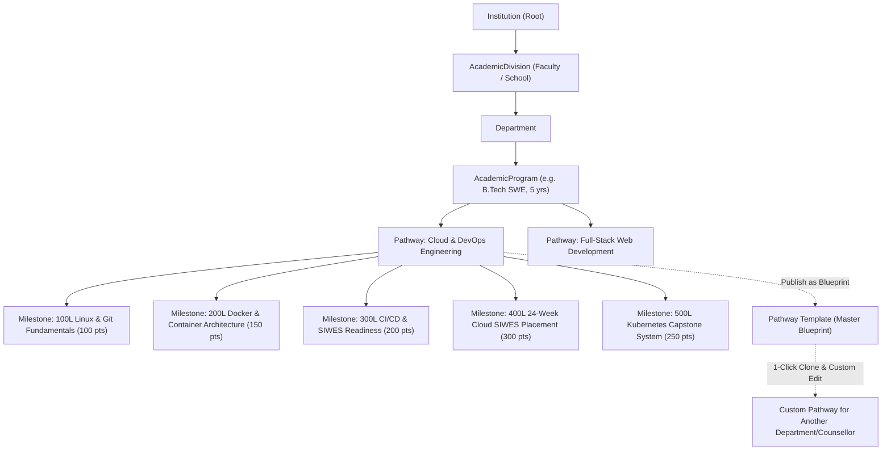
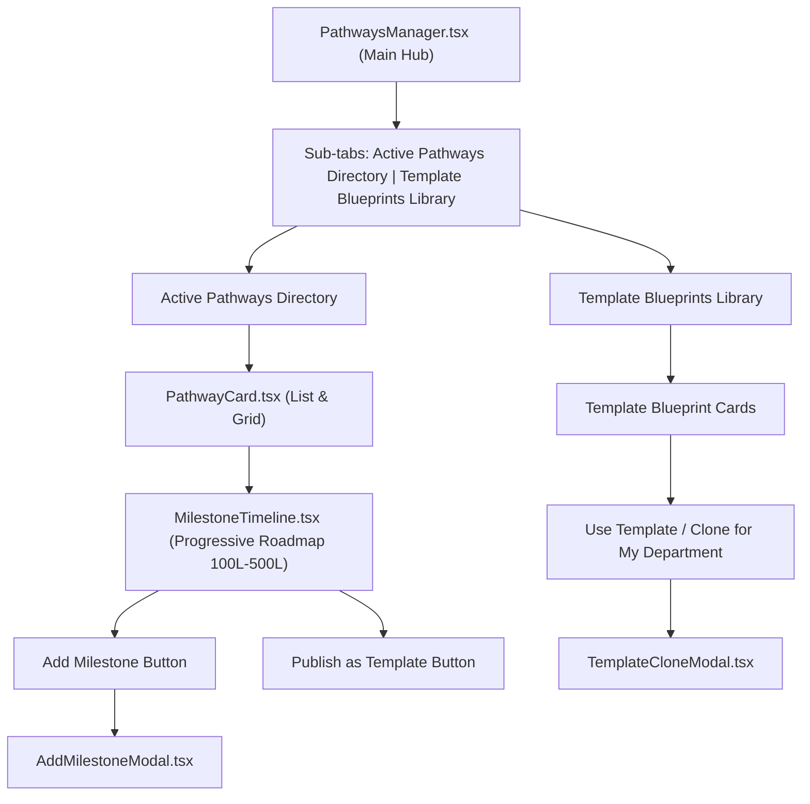

# Career Pathways & Comprehensive Milestones Architecture Plan

> **STATUS**: PROPOSED IMPLEMENTATION PLAN  
> **SCOPE**: Institutional Career Pathways, Level-Aware Milestones, Blueprint Template Catalog, and 1-Click Counsellor Cloning  
> **PRIMARY GOAL**: Enable counsellors and admins to build structured career roadmaps for any academic program, accommodate comprehensive milestones across Nigerian institutional durations, and publish/clone master templates seamlessly.

---

## 1. Executive Mission & System Philosophy

In the Nigerian tertiary education system, students in the same academic program (e.g. *B.Tech Software Engineering* or *ND Computer Science*) often pursue distinct career trajectories:
- **Trajectory A**: *Full-Stack Web & Cloud Engineering*
- **Trajectory B**: *Cybersecurity & Security Operations*
- **Trajectory C**: *Data Engineering & AI Systems*
- **Trajectory D**: *Embedded Systems & IoT Hardware*

To bridge the gap between academic theory and industry employability:
1. **Counsellors & HODs** must be able to define structured, multi-year **Career Pathways** tied to their specific `AcademicProgram`.
2. Each Pathway contains sequenced **Milestones** distributed across the student's study duration (100L through 500L, ND I/II, HND I/II, or NCE I/II/III).
3. Every Milestone incorporates strict verification methods (supervisor sign-offs, live GitHub repositories, certificate PDFs) adhering to the **"Zero Unbacked Claims"** law.
4. **Template Blueprint Engine**: When a counsellor designs an effective pathway, they can mark it as a master **Template**. Any other counsellor (at the same institution or across the national catalog) can preview, 1-click **Clone**, and customize it for their department without overwriting the original blueprint.

---

## 2. Relational Hierarchy & Data Architecture



---

## 3. Data Models Specification (`backend/edusal/institutions/models.py`)

### 3.1 `Pathway` Model
Represents a specific career roadmap for an `AcademicProgram`.

```python
class TemplateVisibility(models.TextChoices):
    DEPARTMENT = "DEPARTMENT", "Department Only"
    INSTITUTION = "INSTITUTION", "Institution-Wide"
    NATIONAL_CATALOG = "NATIONAL_CATALOG", "National Open Catalog"


class Pathway(models.Model):
    """Structured career roadmap for an academic program, containing progressive milestones."""

    id = models.UUIDField(primary_key=True, default=uuid.uuid4, editable=False)
    institution = models.ForeignKey(
        Institution,
        on_delete=models.CASCADE,
        related_name="pathways",
    )
    program = models.ForeignKey(
        AcademicProgram,
        on_delete=models.CASCADE,
        related_name="pathways",
    )
    created_by = models.ForeignKey(
        settings.AUTH_USER_MODEL,
        on_delete=models.SET_NULL,
        null=True,
        blank=True,
        related_name="created_pathways",
    )
    title = models.CharField(
        max_length=200,
        help_text="e.g. Full-Stack Web & Cloud Architecture",
    )
    career_role = models.CharField(
        max_length=150,
        help_text="Target role e.g. Full-Stack Software Engineer, DevOps Specialist",
    )
    industry_sector = models.CharField(
        max_length=100,
        blank=True,
        help_text="e.g. Information Technology / Fintech / Telecommunications",
    )
    description = models.TextField(
        help_text="Comprehensive overview of competencies and expected learning outcomes",
    )
    target_cgpa_recommendation = models.DecimalField(
        max_digits=4,
        decimal_places=2,
        null=True,
        blank=True,
        help_text="Recommended minimum CGPA (e.g. 3.00)",
    )
    total_milestones_count = models.PositiveIntegerField(default=0)
    total_points = models.PositiveIntegerField(
        default=0,
        help_text="Total employability points accumulated across all milestones",
    )
    is_active = models.BooleanField(default=True)
    is_template = models.BooleanField(
        default=False,
        help_text="If True, serves as a master template blueprint in the institutional catalog",
    )
    template_visibility = models.CharField(
        max_length=25,
        choices=TemplateVisibility.choices,
        default=TemplateVisibility.INSTITUTION,
    )
    cloned_from = models.ForeignKey(
        "self",
        on_delete=models.SET_NULL,
        null=True,
        blank=True,
        related_name="cloned_derivatives",
        help_text="Master template from which this pathway was cloned",
    )
    version = models.PositiveIntegerField(default=1)
    created_at = models.DateTimeField(auto_now_add=True)
    updated_at = models.DateTimeField(auto_now=True)

    class Meta:
        ordering = ["program", "title"]
        verbose_name = "Career Pathway"
        verbose_name_plural = "Career Pathways"

    def __str__(self) -> str:
        tag = " [TEMPLATE]" if self.is_template else ""
        return f"{self.title} ({self.program.name}){tag}"

    def recalculate_totals(self) -> None:
        """Updates total_milestones_count and total_points from child milestones."""
        milestones = self.milestones.all()
        self.total_milestones_count = milestones.count()
        self.total_points = sum(m.points for m in milestones)
        self.save(update_fields=["total_milestones_count", "total_points", "updated_at"])
```

---

### 3.2 `PathwayMilestone` Model
Represents an individual verifiable requirement within a pathway.

```python
class MilestoneType(models.TextChoices):
    FOUNDATIONAL_COURSEWORK = "FOUNDATIONAL_COURSEWORK", "Foundational Coursework Prerequisite"
    TECHNICAL_SKILL = "TECHNICAL_SKILL", "Technical Skill Mastery"
    GITHUB_PROJECT = "GITHUB_PROJECT", "Production Repository / Deployed App"
    INDUSTRY_CERTIFICATION = "INDUSTRY_CERTIFICATION", "Industry Recognized Certification"
    SIWES_PREREQUISITE = "SIWES_PREREQUISITE", "SIWES / ITCC Placement Clearance"
    INTERNSHIP_EXPERIENCE = "INTERNSHIP_EXPERIENCE", "Internship / Work Placement"
    CAPSTONE_PROJECT = "CAPSTONE_PROJECT", "Final Year Capstone Project Defense"
    CAREER_READINESS = "CAREER_READINESS", "Portfolio & Technical Interview Readiness"


class VerificationMethod(models.TextChoices):
    SUPERVISOR_SIGN_OFF = "SUPERVISOR_SIGN_OFF", "Counsellor / HOD Sign-Off"
    URL_VERIFICATION = "URL_VERIFICATION", "Repository / Live URL Review"
    DOCUMENT_UPLOAD = "DOCUMENT_UPLOAD", "Certificate / Document PDF Upload"
    AUTOMATED_ASSESSMENT = "AUTOMATED_ASSESSMENT", "Automated Assessment / Quiz"


class RequiredEvidenceType(models.TextChoices):
    GITHUB_REPO = "GITHUB_REPO", "GitHub / GitLab Repository URL"
    LIVE_URL = "LIVE_URL", "Live Deployed Project URL"
    CERTIFICATE_PDF = "CERTIFICATE_PDF", "Certificate PDF / Verified Credential Link"
    PORTFOLIO_LINK = "PORTFOLIO_LINK", "Portfolio Link (Behance, Dribbble, Personal Site)"
    SUPERVISOR_ENDORSEMENT = "SUPERVISOR_ENDORSEMENT", "Faculty / Industry Supervisor Form"


class PathwayMilestone(models.Model):
    """Verifiable progressive requirement within a career pathway."""

    id = models.UUIDField(primary_key=True, default=uuid.uuid4, editable=False)
    pathway = models.ForeignKey(
        Pathway,
        on_delete=models.CASCADE,
        related_name="milestones",
    )
    order_index = models.PositiveSmallIntegerField(
        default=0,
        help_text="Sequence order within the pathway",
    )
    year_of_study = models.PositiveSmallIntegerField(
        default=1,
        help_text="Target academic year (1..5) matching student year of study",
    )
    target_level_code = models.CharField(
        max_length=20,
        blank=True,
        help_text="e.g. '100', '200', '300', '400', '500', 'ND_I', 'ND_II', 'NCE_I', 'NCE_II', 'NCE_III'",
    )
    target_semester = models.CharField(
        max_length=20,
        choices=[
            ("FIRST", "First Semester"),
            ("SECOND", "Second Semester"),
            ("BOTH", "Both Semesters / Annual"),
        ],
        default="FIRST",
    )
    title = models.CharField(
        max_length=255,
        help_text="e.g. Deploy Modular Microservice with CI/CD Pipeline",
    )
    description = models.TextField(
        help_text="Specific deliverables, rubric criteria, and requirements",
    )
    milestone_type = models.CharField(
        max_length=30,
        choices=MilestoneType.choices,
        default=MilestoneType.TECHNICAL_SKILL,
    )
    points = models.PositiveIntegerField(
        default=100,
        help_text="Employability weighting score assigned to this milestone",
    )
    is_mandatory = models.BooleanField(
        default=True,
        help_text="Whether completion is strictly required for pathway badge",
    )
    verification_method = models.CharField(
        max_length=30,
        choices=VerificationMethod.choices,
        default=VerificationMethod.SUPERVISOR_SIGN_OFF,
    )
    required_evidence_type = models.CharField(
        max_length=30,
        choices=RequiredEvidenceType.choices,
        default=RequiredEvidenceType.GITHUB_REPO,
    )
    competency_tags = models.JSONField(
        default=list,
        blank=True,
        help_text="List of skill keywords, e.g. ['React', 'TypeScript', 'Docker', 'PostgreSQL']",
    )
    created_at = models.DateTimeField(auto_now_add=True)
    updated_at = models.DateTimeField(auto_now=True)

    class Meta:
        ordering = ["pathway", "order_index", "year_of_study"]
        verbose_name = "Pathway Milestone"
        verbose_name_plural = "Pathway Milestones"

    def __str__(self) -> str:
        return f"{self.pathway.title} — Step {self.order_index + 1}: {self.title} ({self.points} pts)"
```

---

## 4. Deep Clone & Template Blueprint Engine (`backend/edusal/institutions/services/pathway_template_service.py`)

A specialized service responsible for:
1. **Deep Cloning**: Duplicating a master template pathway along with all its milestones into a target institution and program.
2. **Template Publishing**: Converting an existing custom pathway into a catalog blueprint.
3. **Template Discovery**: Querying templates by program award level (`BSC`, `BENG`, `ND`, `HND`, `NCE`) and industry keywords.

### Cloning Algorithm:
```python
class PathwayTemplateService:
    @classmethod
    def clone_template_to_program(
        cls,
        template_id: str,
        target_program: AcademicProgram,
        user,
        custom_title: Optional[str] = None,
        custom_description: Optional[str] = None,
    ) -> Pathway:
        """
        Deep-copies a master template pathway and all its milestones to a target program.
        Runs inside an atomic transaction.
        """
        with transaction.atomic():
            template = Pathway.objects.select_related("program").prefetch_related("milestones").get(id=template_id)
            
            new_pathway = Pathway.objects.create(
                institution=target_program.institution,
                program=target_program,
                created_by=user,
                title=custom_title or f"{template.title} (Customized)",
                career_role=template.career_role,
                industry_sector=template.industry_sector,
                description=custom_description or template.description,
                target_cgpa_recommendation=template.target_cgpa_recommendation,
                is_active=True,
                is_template=False,
                template_visibility=TemplateVisibility.DEPARTMENT,
                cloned_from=template,
                version=1,
            )

            cloned_milestones = []
            for m in template.milestones.all():
                cloned_milestones.append(
                    PathwayMilestone(
                        pathway=new_pathway,
                        order_index=m.order_index,
                        year_of_study=min(m.year_of_study, target_program.duration_years),
                        target_level_code=m.target_level_code,
                        target_semester=m.target_semester,
                        title=m.title,
                        description=m.description,
                        milestone_type=m.milestone_type,
                        points=m.points,
                        is_mandatory=m.is_mandatory,
                        verification_method=m.verification_method,
                        required_evidence_type=m.required_evidence_type,
                        competency_tags=list(m.competency_tags),
                    )
                )

            PathwayMilestone.objects.bulk_create(cloned_milestones)
            new_pathway.recalculate_totals()
            return new_pathway
```

---

## 5. REST API Specifications & Endpoints

### 5.1 Endpoints Summary

| Method | Endpoint | Description |
| :--- | :--- | :--- |
| `GET` | `/api/pathways/` | List pathways (filter by `institution`, `program`, `is_template`, `department`) |
| `POST` | `/api/pathways/` | Create a new custom career pathway |
| `GET` | `/api/pathways/{id}/` | Retrieve full pathway with ordered milestones |
| `PATCH` | `/api/pathways/{id}/` | Update pathway details, title, or target CGPA |
| `DELETE` | `/api/pathways/{id}/` | Delete pathway and its milestones |
| `POST` | `/api/pathways/{id}/clone/` | **Clone template**: Creates custom pathway for program with all milestones |
| `POST` | `/api/pathways/{id}/publish-as-template/` | **Publish blueprint**: Marks pathway as template for other counsellors |
| `GET` | `/api/pathways/templates/` | **Template Library**: Returns all reusable blueprints filtered by award level |
| `POST` | `/api/milestones/` | Add a new milestone to a pathway (auto-updates pathway totals) |
| `PATCH` | `/api/milestones/{id}/` | Update milestone title, points, evidence type, competencies |
| `DELETE` | `/api/milestones/{id}/` | Delete milestone (auto-recalculates pathway points) |
| `POST` | `/api/milestones/reorder/` | Reorder milestones in a pathway |

---

## 6. Standard Master Seed Blueprints

During initial database seeding, pre-load industry-standard blueprints for immediate counsellor use:

1. **University Software Engineering (5-Year B.Tech / B.Eng)**:
   - *Title*: **Full-Stack Cloud & DevOps Engineering**
   - *100L*: Version Control (Git/GitHub) & CLI Fundamentals (50 pts)
   - *200L*: Relational Databases & Schema Normalization (100 pts)
   - *300L*: Containerization (Docker) & REST API Architecture (150 pts)
   - *400L*: 24-Week Industrial SIWES Attachment with Signed Logbook (300 pts)
   - *500L*: Production Capstone System with Automated CI/CD & Security Audit (250 pts)
   - *Total*: 850 Points

2. **Polytechnic Computer Science (2-Year ND Track)**:
   - *Title*: **Frontend Web & UI/UX Engineering**
   - *ND I*: Semantic Web & Responsive Design (100 pts)
   - *ND I*: Client-Side JavaScript & React State Management (150 pts)
   - *ND II*: 16-Week SIWES Industrial Attachment (250 pts)
   - *ND II*: Capstone Web Application Defense (200 pts)
   - *Total*: 700 Points

3. **College of Education (3-Year NCE Track)**:
   - *Title*: **Educational Technology & Digital Pedagogy**
   - *NCE I*: Interactive Courseware Authoring (100 pts)
   - *NCE II*: LMS Administration & Blended Assessment (150 pts)
   - *NCE III*: Teaching Practice Attachment & Portfolio Defense (300 pts)
   - *Total*: 550 Points

---

## 7. Frontend UI & Interaction Architecture

### 7.1 Institution Dashboard Navigation
Add **Tab 6: "Career Pathways & Milestones"** (`activeTab === 'pathways'`) to [`InstitutionDashboard.tsx`](file:///home/cainoa/dev/projects/edusal/frontend/src/components/institution/InstitutionDashboard.tsx).

### 7.2 Component Breakdown



### 7.3 Modal & UI Design Directives
1. **Opaque & High Contrast**: Solid white `#ffffff` backgrounds on all modals with visible borders (`#cbd5e1`) and dark `#0f172a` text.
2. **Zero Emojis**: Use modern SVG icons (`<CompassIcon />`, `<FolderTreeIcon />`, `<CheckCircleIcon />`, `<PlusIcon />`, `<CopyIcon />`, `<UploadIcon />`, `<SparklesIcon />`).
3. **Level-Aware Timeline Canvas**: Visually groups milestones by academic level (e.g. *100 Level*, *200 Level*, *300 Level (SIWES)*, *400 Level*, *500 Level (Final Year)*) with color-coded milestone type pills.
4. **Competency Tags Input**: Chip input allowing counsellors to type and add skill tags (`"PostgreSQL"`, `"Docker"`, `"React"`).

---

## 8. Step-by-Step Implementation Roadmap

### Phase 1: Models, Migrations & Signals
- Create `Pathway` and `PathwayMilestone` models in `backend/edusal/institutions/models.py`.
- Add `TemplateVisibility`, `MilestoneType`, `VerificationMethod`, `RequiredEvidenceType` enums.
- Run `makemigrations` and `migrate`.

### Phase 2: Template Cloning Service
- Create `backend/edusal/institutions/services/pathway_template_service.py` with `clone_template_to_program()` and `publish_as_template()`.

### Phase 3: REST API Serializers & ViewSets
- Create `PathwayMilestoneSerializer`, `PathwayListSerializer`, `PathwayDetailSerializer`, `PathwayClonePayloadSerializer` in `backend/edusal/institutions/api/serializers.py`.
- Create `PathwayViewSet` and `PathwayMilestoneViewSet` in `backend/edusal/institutions/api/views.py`.
- Register routes in `backend/edusal/institutions/api/urls.py`.

### Phase 4: Master Seed Blueprints
- Update `backend/edusal/institutions/management/commands/seed_institutions.py` to seed master blueprint templates for FUTMinna, YabaTech, and FCE Zaria.

### Phase 5: Frontend TypeScript Types & API Client
- Add `Pathway`, `PathwayMilestone`, `MilestoneType`, `VerificationMethod`, `RequiredEvidenceType` types in `frontend/src/types/institution.ts`.
- Add API methods in `frontend/src/services/institutionApi.ts` (`getPathways`, `getPathwayDetail`, `createPathway`, `clonePathway`, `publishPathwayTemplate`, `getTemplates`, `createMilestone`, `updateMilestone`, `deleteMilestone`).

### Phase 6: Frontend UI Components
- Build `AddMilestoneModal.tsx` (solid `#ffffff` background).
- Build `TemplateCloneModal.tsx` (preview master blueprint and select target department/program).
- Build `MilestoneTimeline.tsx` (level-by-level visual roadmap).
- Build `PathwaysManager.tsx` (main directory + template library).
- Wire Tab 6 in `InstitutionDashboard.tsx` and style in `frontend/src/App.css`.

### Phase 7: Pytest Test Suite & Build Verification
- Write `test_pathways_and_templates.py` testing:
  - CRUD operations for pathways and milestones.
  - Automatic total points and milestone count recalculation.
  - Template cloning into new programs with deep milestone duplication.
  - Multi-tenant boundary isolation.
- Run full Pytest suite and `npm run build`.

---

## 9. Future Integration: EmployabilityScore Scaffolding

With `Pathway` and `PathwayMilestone` in place:
1. `StudentProfile` will link to an active pathway: `active_pathway = models.ForeignKey(Pathway, null=True, blank=True)`.
2. When a student completes a milestone and submits evidence, a `StudentMilestoneSubmission` record is verified by the counsellor.
3. The `EmployabilityScore` algorithm will calculate:
   $$\text{EmployabilityScore} = \left(\frac{\sum \text{Verified Milestone Points}}{\text{Pathway Total Points}}\right) \times 70\% + (\text{CGPA Normalized}) \times 30\%$$
   providing an evidence-backed employability rating.

---

> [!NOTE]
> This plan is ready for review and execution. Once approved, we will proceed phase-by-phase with full testing and git commits.
