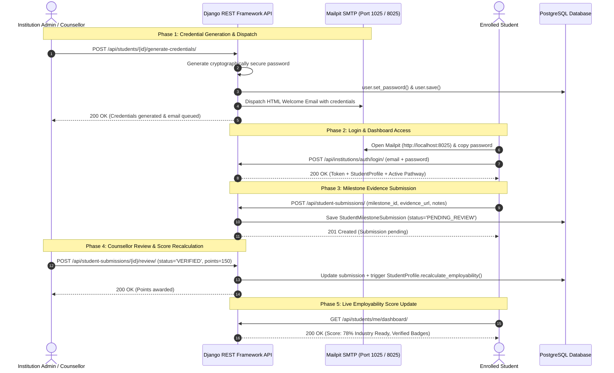

# Comprehensive Architecture Plan: Student Dashboard, Credential Dispatch & Employability Scoring Engine

**Document Version:** 1.0.0  
**Target Repository:** `webalb/edusal` (`main` branch)  
**Status:** PROPOSED & READY FOR IMPLEMENTATION  
**Relevant Tech Stack:** Django 6.0 + DRF + Celery + Mailpit (SMTP Port 1025, Web Port 8025) + React 18 + TypeScript + Vite  

---

## 1. Executive Summary & Problem Context

With the **Career Pathways & Milestones Engine** now fully operational (with 5-year B.Tech, 2-year ND/HND, and 3-year NCE blueprints), the next critical pillar is the **Student Portal Experience & Verification Lifecycle**.

### Core Objectives
1. **Administrative Credential Issuance & Test Mail Dispatch**:
   - Institution Administrators, Deans, and HODs can generate initial passwords or reset credentials for any student in their institution/department.
   - An automated, professionally styled HTML welcome email containing login credentials, matriculation number, and portal link is immediately dispatched via Django's SMTP backend into the project's local **Mailpit** server (`mailpit:1025` / UI at `http://localhost:8025`).
2. **Student Authentication & Role-Based Access Control (RBAC)**:
   - Dedicated authentication routing that identifies whether a logged-in user is an **Institution Staff** member (Dean, HOD, Counsellor, Admin) or a **Student**.
   - Students are automatically redirected to their dedicated **Student Workspace**, while staff land on the **Institution Governance Portal**.
   - Strict tenant and profile boundary isolation ensuring students can only read their own records and submit evidence to their own program's pathways.
3. **Interactive Pathway Roadmap & Evidence Submission**:
   - Students view their degree program's active career pathway sequenced by academic year (e.g. 100L through 500L, ND I/II, NCE I/II/III).
   - Students can upload evidence (GitHub/GitLab repository URL, live deployed app link, portfolio URL, certificate PDF) and contextual notes for each milestone.
4. **Counsellor Evaluation & Review Workflow**:
   - Department counsellors and HODs can inspect submitted evidence, provide constructive feedback, request revisions, or approve and award employability points.
5. **Real-Time Employability Score Calculation**:
   - Real-time aggregation of verified points against pathway targets (70% weight) combined with normalized academic standing / CGPA (30% weight), generating an accredited Employability Quotient (0–100%) with tier badges (*Foundational*, *Developing*, *Industry Ready*, *High-Calibre Talent*).

---

## 2. System Architecture & Information Flow



---

## 3. Data Models & Database Design

### 3.1. `StudentProfile` Model Enhancements
In [`backend/edusal/institutions/models.py`](file:///home/cainoa/dev/projects/edusal/backend/edusal/institutions/models.py):
- Add `active_pathway = ForeignKey(Pathway, null=True, blank=True, on_delete=models.SET_NULL, related_name="enrolled_students")`.
- Add cached score fields:
  - `employability_score = DecimalField(max_digits=5, decimal_places=2, default=0.00)`
  - `verified_points_total = PositiveIntegerField(default=0)`
  - `milestones_completed_count = PositiveIntegerField(default=0)`
- Add method `calculate_employability_score() -> dict`:
  $$\text{MilestonePointsRatio} = \frac{\sum \text{Verified Submission Points}}{\max(\text{active\_pathway.total\_points}, 1)}$$
  $$\text{MilestoneComponent} = \min(\text{MilestonePointsRatio}, 1.0) \times 70.0$$
  $$\text{CGPAComponent} = \left(\frac{\min(\text{cgpa or 0.0}, 5.0)}{5.0}\right) \times 30.0$$
  $$\text{EmployabilityScore} = \text{round}(\text{MilestoneComponent} + \text{CGPAComponent}, 2)$$

### 3.2. `StudentMilestoneSubmission` Model
```python
class SubmissionStatus(models.TextChoices):
    PENDING_REVIEW = "PENDING_REVIEW", "Pending Review"
    VERIFIED = "VERIFIED", "Verified & Points Awarded"
    CHANGES_REQUESTED = "CHANGES_REQUESTED", "Changes / Re-submission Requested"
    REJECTED = "REJECTED", "Rejected / Incomplete"

class StudentMilestoneSubmission(models.Model):
    id = models.UUIDField(primary_key=True, default=uuid.uuid4, editable=False)
    student = models.ForeignKey(
        StudentProfile,
        on_delete=models.CASCADE,
        related_name="milestone_submissions",
    )
    milestone = models.ForeignKey(
        PathwayMilestone,
        on_delete=models.CASCADE,
        related_name="submissions",
    )
    status = models.CharField(
        max_length=25,
        choices=SubmissionStatus.choices,
        default=SubmissionStatus.PENDING_REVIEW,
    )
    evidence_url = models.URLField(
        blank=True,
        null=True,
        help_text="GitHub repository URL or Live demo deployment link",
    )
    evidence_file = models.FileField(
        upload_to="student_evidence/%Y/%m/",
        blank=True,
        null=True,
        help_text="Uploaded certificate PDF or supervisor endorsement form",
    )
    submission_notes = models.TextField(
        blank=True,
        help_text="Student description of work completed, architectural decisions, or SIWES context",
    )
    points_awarded = models.PositiveIntegerField(
        default=0,
        help_text="Points awarded upon verification (defaults to milestone.points)",
    )
    reviewed_by = models.ForeignKey(
        settings.AUTH_USER_MODEL,
        on_delete=models.SET_NULL,
        null=True,
        blank=True,
        related_name="reviewed_milestones",
    )
    reviewed_at = models.DateTimeField(null=True, blank=True)
    review_feedback = models.TextField(
        blank=True,
        help_text="Counsellor or HOD remarks and evaluation notes",
    )
    created_at = models.DateTimeField(auto_now_add=True)
    updated_at = models.DateTimeField(auto_now=True)

    class Meta:
        ordering = ["-created_at"]
        unique_together = [["student", "milestone"]]
```

---

## 4. Credential Dispatch & Email Service

### 4.1. `StudentCredentialService`
In `backend/edusal/institutions/services/student_credential_service.py`:
- `generate_and_dispatch_credentials(student_profile_id: str, custom_password: Optional[str] = None, sent_by_user = None) -> dict`:
  1. Retrieves `StudentProfile` and associated `User`.
  2. Generates a readable, secure password (e.g. `EduSal-2026!k9X`) if `custom_password` is not supplied.
  3. Updates password via `user.set_password(plain_password)` and saves in a database transaction.
  4. Renders both HTML and plain text email templates using Django's template engine:
     - Recipient: `student.user.email`
     - Subject: `Your Student Portal Login Credentials — {institution.name}`
     - From: `no-reply@{institution.slug}.edusal.ng`
     - Template variables: Student Name, Matriculation Number, Degree Programme, Institution, Temporary Password, Portal Login URL (`http://localhost:5173`).
  5. Sends email via `django.core.mail.EmailMultiAlternatives` through Mailpit SMTP (port 1025).
  6. Returns structured response with `email`, `matric_number`, `plain_password`, and `dispatch_status`.

---

## 5. REST API Endpoints Specification

### 5.1. Student Administration Endpoints
| HTTP Method | Endpoint | Description | Access Control |
|---|---|---|---|
| `POST` | `/api/students/{id}/generate-credentials/` | Generates password & sends welcome email | Institution Admin, Dean, HOD |
| `POST` | `/api/students/{id}/enroll-pathway/` | Enrolls student into a specific pathway | Student (self), Admin, HOD |

### 5.2. Student Portal Endpoints
| HTTP Method | Endpoint | Description | Access Control |
|---|---|---|---|
| `GET` | `/api/students/me/dashboard/` | Returns student profile, active pathway roadmap, submission status, and employability score | Authenticated Student |
| `GET` | `/api/student-submissions/` | Lists submissions (filtered by student/milestone) | Student (own) / Staff |
| `POST` | `/api/student-submissions/` | Submits milestone evidence (URL, file, notes) | Authenticated Student |
| `PATCH` | `/api/student-submissions/{id}/` | Updates pending evidence before review | Authenticated Student |

### 5.3. Counsellor Review Endpoints
| HTTP Method | Endpoint | Description | Access Control |
|---|---|---|---|
| `POST` | `/api/student-submissions/{id}/review/` | Approves (`VERIFIED`), rejects, or requests changes + awards points | Institution Staff / Counsellor |

---

## 6. Frontend UI Architecture

### 6.1. Component Structure
```
frontend/src/components/
├── institution/
│   ├── InstitutionLogin.tsx (Dual login: Staff vs Student toggle)
│   ├── StudentRoster.tsx (Added "Generate Credentials & Email" button)
│   └── GenerateCredentialModal.tsx (Admin password generator with Mailpit link)
└── student/
    ├── StudentDashboard.tsx (Main container)
    ├── StudentHeader.tsx (Profile banner, dynamic level badge, SIWES status)
    ├── EmployabilityGaugeCard.tsx (Visual score meter, points breakdown, tier badge)
    ├── StudentRoadmapTimeline.tsx (Level-by-level progressive milestone submission cards)
    ├── SubmitEvidenceModal.tsx (Solid #ffffff modal for URL/file upload)
    └── SubmissionDetailModal.tsx (View submission details, reviewer feedback, points)
```

### 6.2. Visual Styling & Design Directives
- **Zero emojis anywhere**: Strict compliance with system design rules using Lucide SVG icons.
- **Opaque, solid white `#ffffff` surfaces**: Form controls, cards, and modal dialogs have solid backgrounds with `#cbd5e1` borders and `#0f172a` primary text.
- **High-contrast badges**:
  - `Verified (+150 pts)`: `#ecfdf5` background, `#059669` text, `#a7f3d0` border.
  - `Pending Review`: `#fef3c7` background, `#b45309` text, `#fde68a` border.
  - `Changes Requested`: `#eff6ff` background, `#1d4ed8` text, `#bfdbfe` border.
  - `Not Started`: `#f1f5f9` background, `#64748b` text.

---

## 7. Step-by-Step Implementation Roadmap (7 Phases)

### Phase 1: Database Models & Migrations
- Add `active_pathway`, `employability_score`, `verified_points_total`, and `milestones_completed_count` to `StudentProfile`.
- Add `StudentMilestoneSubmission` model with status enums.
- Run `python manage.py makemigrations` and `migrate`.

### Phase 2: Credential Generation & Mailpit Email Service
- Build `StudentCredentialService` with email template generation and Mailpit SMTP dispatch.
- Create HTML and text email templates in `backend/edusal/institutions/templates/emails/`.

### Phase 3: Employability Scoring & Calculation Engine
- Implement real-time points aggregation and 70/30 weighting logic in `StudentProfile.recalculate_employability()`.

### Phase 4: Serializers, ViewSets & API Routes
- Add serializers: `StudentMilestoneSubmissionSerializer`, `StudentSubmissionCreateSerializer`, `StudentSubmissionReviewSerializer`, `StudentDashboardDataSerializer`.
- Add ViewSets: `StudentMilestoneSubmissionViewSet`, and actions `generate_credentials`, `enroll_pathway`, and `me/dashboard` on `StudentProfileViewSet`.

### Phase 5: Frontend TypeScript Types & API Client
- Define `StudentMilestoneSubmission`, `SubmissionStatus`, `StudentDashboardData` in `frontend/src/types/institution.ts`.
- Add API client methods in `frontend/src/services/institutionApi.ts`.

### Phase 6: Frontend UI Components
- Build `GenerateCredentialModal.tsx` in `StudentRoster.tsx`.
- Build `StudentDashboard.tsx`, `EmployabilityGaugeCard.tsx`, `StudentRoadmapTimeline.tsx`, and `SubmitEvidenceModal.tsx`.
- Update `App.tsx` to route authenticated students directly to their Student Dashboard.
- Add complete CSS styling in `App.css`.

### Phase 7: Pytest Test Suite & Build Verification
- Write `backend/edusal/institutions/tests/test_student_dashboard_and_credentials.py` covering:
  - Credential generation and `mail.outbox` verification.
  - Pathway enrollment.
  - Student evidence submission.
  - Staff review & points awarding.
  - Employability score calculation accuracy.
- Verify production build (`npm run build`).

---

## 8. Verification & Test Plan

1. **Email Delivery Test via Mailpit**:
   - Institution Admin triggers password generation for `student.swe@futminna.edu.ng`.
   - Verify email appears in Mailpit web console (`http://localhost:8025`) with matching temporary password.
2. **Student Portal Login**:
   - Log in as `student.swe@futminna.edu.ng` using the generated password.
   - Verify student workspace opens showing B.Tech Software Engineering active pathway.
3. **Evidence Submission & Evaluation**:
   - Student submits GitHub URL for `Version Control (Git/GitHub) Mastery`.
   - Status changes to `Pending Review`.
   - Counsellor logs in, reviews submission, approves with feedback, and awards 50 points.
   - Student dashboard refreshes with updated Employability Score and verified milestone chip.
